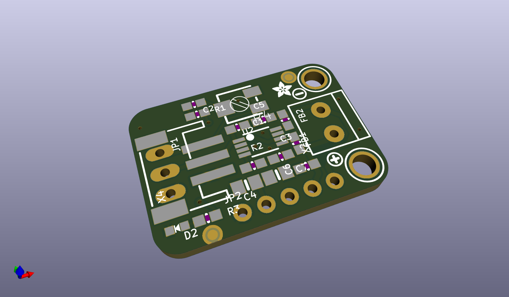
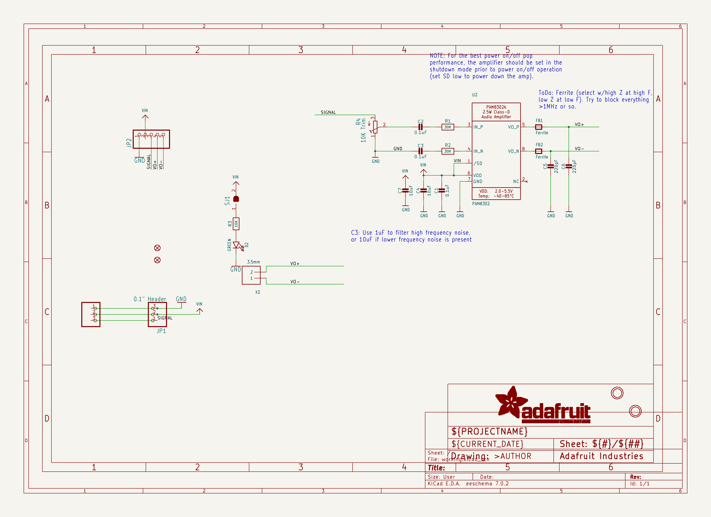
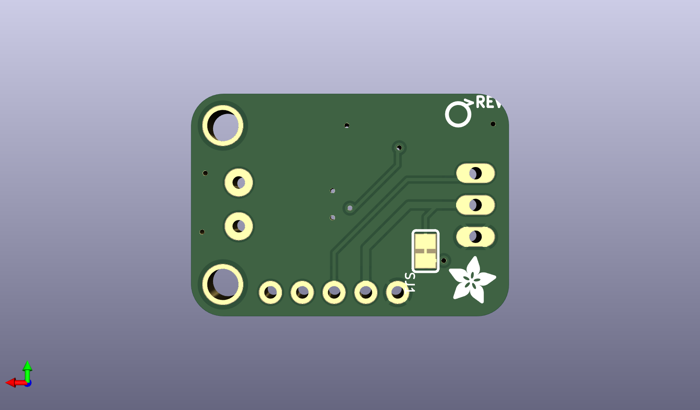
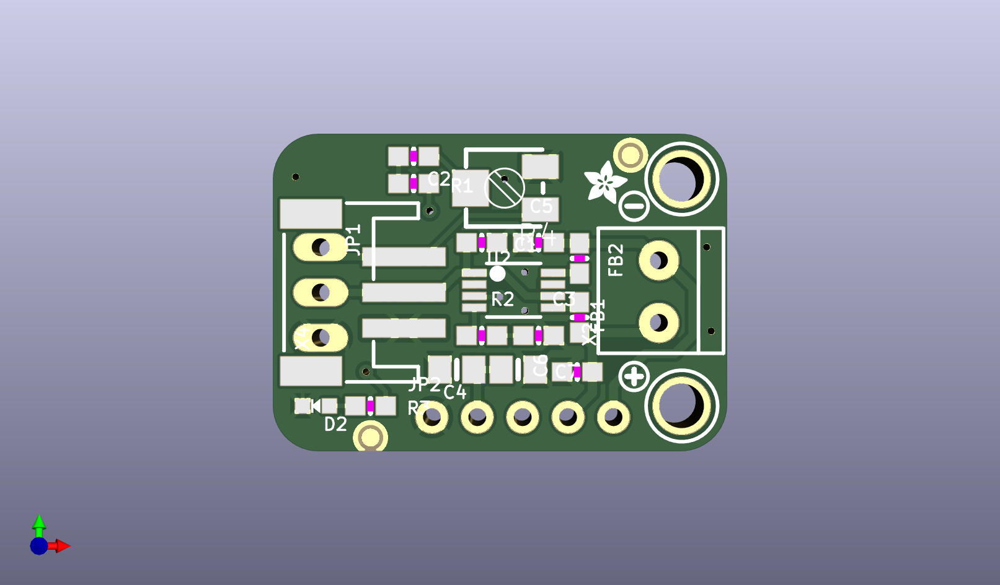

# None

## Description
None/
## Schematic

## Bill of Materials
| Id | Designator | Footprint | Quantity | Designation | Supplier and ref |  |
| --- | --- | --- | --- | --- | --- | --- |
| 1 | PLABEL2 | PLABEL2 | 1 |  |  |  |
| 2 | PLABEL0 | PLABEL0 | 1 |  |  |  |
| 3 | C5,C6 | 0603-NO | 2 | 220pF |  |  |
| 4 | U2 | MSOP8_0.65MM | 1 | PAM8302 |  |  |
| 5 | R2,R1 | 0603-NO | 2 | 30K |  |  |
| 6 | FID3,FID2 | FIDUCIAL_1MM | 2 | FIDUCIAL_1MM |  |  |
| 7 | R4 | RTRIM3314J | 1 | 10K Trim |  |  |
| 8 | FB2,FB1 | 0603-NO | 2 | Ferrite |  |  |
| 9 | U$8,U$1 | MOUNTINGHOLE_2.5_PLA TED | 2 | MOUNTINGHOLE2.5 |  |  |
| 10 | C4,C7 | 0805-NO | 2 | 10uF |  |  |
| 11 | X2 | TERMBLOCK_1X2-3.5MM | 1 | 3.5mm |  |  |
| 12 | D2 | CHIPLED_0603_NOOUTLI NE | 1 | GREEN |  |  |
| 13 | U$3 | SYMBOL_PLUS | 1 |  |  |  |
| 14 | C2,C1,C3 | 0603-NO | 3 | 0.1uF |  |  |
| 15 | JP2 | 1X05_ROUND_70 | 1 |  |  |  |
| 16 | PLABEL1 | PLABEL1 | 1 |  |  |  |
| 17 | JP1 | 1X03_OVAL | 1 | 0.1 Header" |  |  |
| 18 | R3 | 0603-NO | 1 | 10K |  |  |
| 19 | U$9 | SYMBOL_MINUS | 1 |  |  |  |
| 20 | X4 | JSTPH3 | 1 | JST PH 3 |  |  |
| 21 | U$19 | ADAFRUIT_2.5MM | 1 |  |  |  |
| 22 | PLABEL4 | PLABEL4 | 1 |  |  |  |
| 23 | PLABEL9 | PLABEL9 | 1 |  |  |  |
| 24 | PLABEL6 | PLABEL6 | 1 |  |  |  |
| 25 | PLABEL3 | PLABEL3 | 1 |  |  |  |
| 26 | PLABEL10 | PLABEL10 | 1 |  |  |  |
| 27 | PLABEL8 | PLABEL8 | 1 |  |  |  |
| 28 | U$5 | PCBFEAT-REV-040 | 1 |  |  |  |
| 29 | SJ1 | SOLDERJUMPER_CLOSEDW IRE | 1 |  |  |  |
| 30 | PLABEL11 | PLABEL11 | 1 |  |  |  |
| 31 | PLABEL7 | PLABEL7 | 1 |  |  |  |
| 32 | U$12 | ADAFRUIT_3.5MM | 1 |  |  |  |
| 33 | PLABEL12 | PLABEL12 | 1 |  |  |  |
| 34 | PLABEL5 | PLABEL5 | 1 |  |  |  |

## Images

