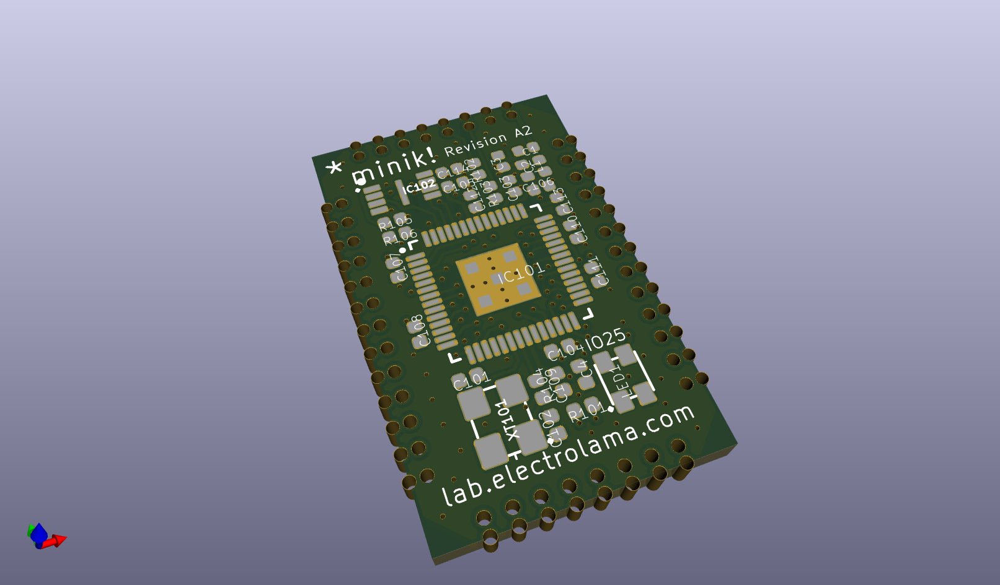
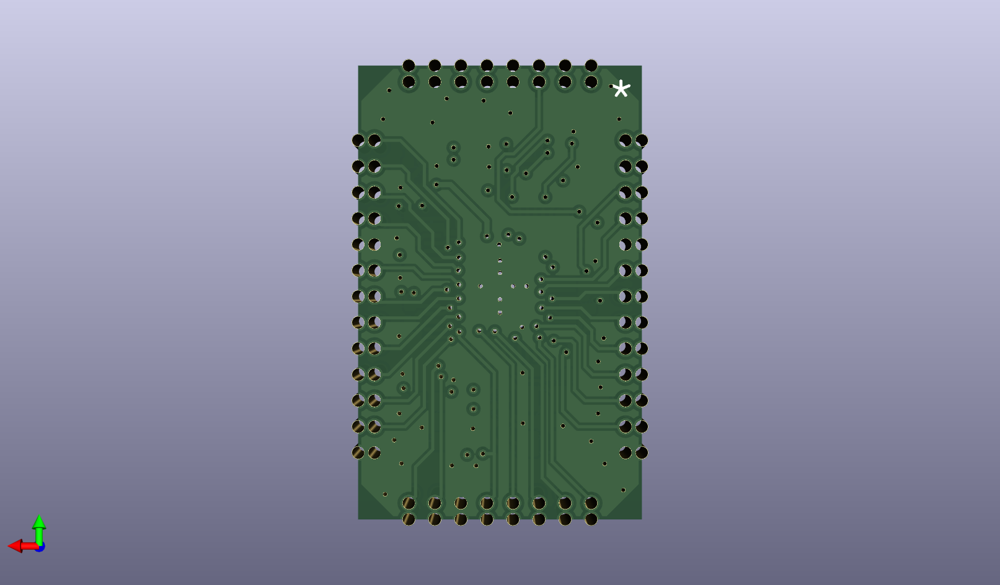

# None

## Description
None/
## Bill of Materials
| Id | Designator | Footprint | Quantity | Designation | Supplier and ref |  |
| --- | --- | --- | --- | --- | --- | --- |
| 1 | C2,C110,C113,C107,C1 12,C114,C109,C105,C1 08,C111,C4,C104 | _PKG_C_0402 | 12 | 100n |  |  |
| 2 | R106,R104 | _PKG_R_0402 | 2 | 1k |  |  |
| 3 | R103,R102 | _PKG_R_0402 | 2 | 27 |  |  |
| 4 | C1 | _PKG_C_0402 | 1 | 10n |  |  |
| 5 | C3 | _PKG_C_0402 | 1 | 10u |  |  |
| 6 | IC102 | SON50P300X200X60-9N | 1 | MEMORY-W25Q16FWUXIE |  |  |
| 7 | C101,C102 | _PKG_C_0402 | 2 | 12p |  |  |
| 8 | L1 | _PKG_L_0402 | 1 |  |  |  |
| 9 | IC101 | QFN-56 | 1 | RP2040 |  |  |
| 10 | LED1 | WS2812B-2020 | 1 | WS2812B-2020 |  |  |
| 11 | R101,R105 | _PKG_R_0402 | 2 | 10k |  |  |
| 12 | C103,C106 | _PKG_C_0402 | 2 | 1u |  |  |
| 13 | XT101 | XTAL-4P-3225 | 1 | 12MHz |  |  |

## Images

