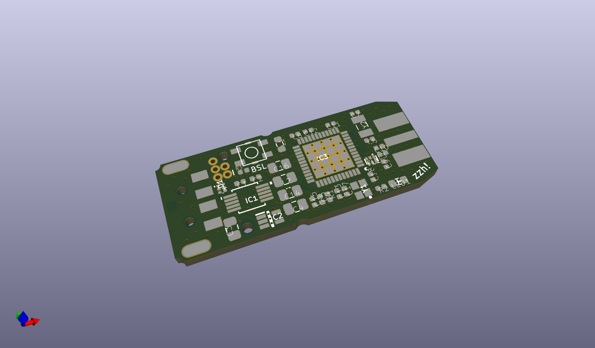
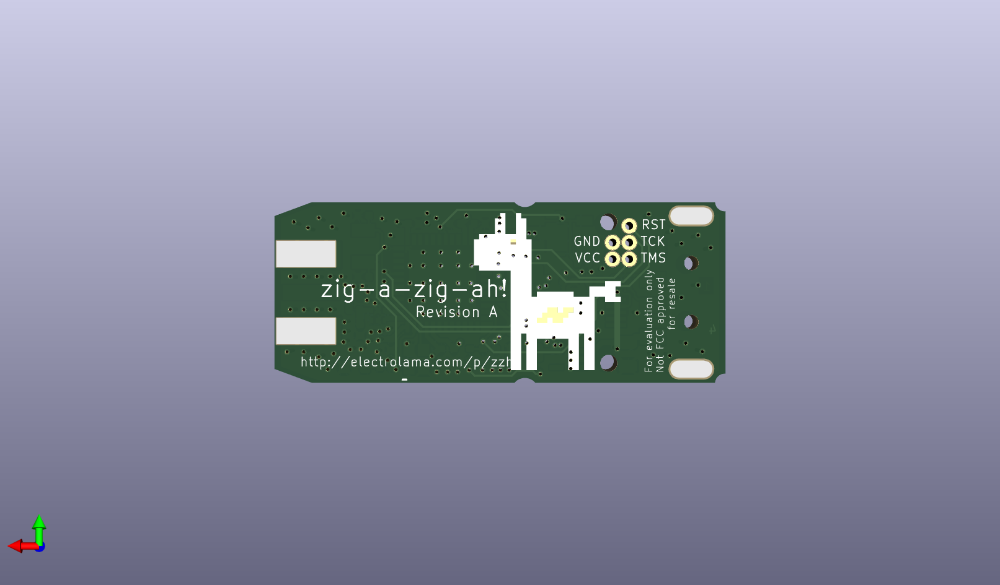
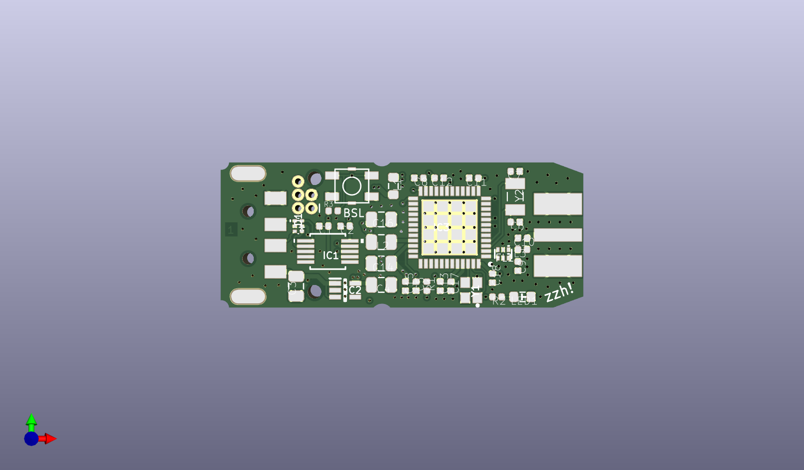

# None

## Description
None/
## Bill of Materials
| Id | Designator | Footprint | Quantity | Designation | Supplier and ref |  |
| --- | --- | --- | --- | --- | --- | --- |
| 1 | C10,C9 | _PKG_C_0402 | 2 | DNP |  |  |
| 2 | C3,C4,C14,C16 | _PKG_C_0805 | 4 | 22u |  |  |
| 3 | L2 | _PKG_C_0805 | 1 | MLZ2012N6R8LT000 |  |  |
| 4 | C13,C18,C5,C1,C11,C1 2,C15,C17,C2 | _PKG_C_0402 | 9 | 100n |  |  |
| 5 | IC3 | QFN50P700X700X100-49 N | 1 | CC2652R1FRGZ |  |  |
| 6 | R3,R1 | _PKG_C_0402 | 2 | 100K |  |  |
| 7 | Y1 | XTAL-4P-2016 | 1 | Q22FA12800150 |  |  |
| 8 | LED1 | _PKG_LED_0603 | 1 |  |  |  |
| 9 | C8 | _PKG_C_0402 | 1 | 1u |  |  |
| 10 | IC1 | _PKG_MSOP10_TI-DGS10 | 1 | CH340E |  |  |
| 11 | L3 | _PKG_L_0402 | 1 | 0 |  |  |
| 12 | Y2 | XTAL-2P-3215 | 1 | 32.768KHz |  |  |
| 13 | R2 | _PKG_C_0402 | 1 | 100 |  |  |
| 14 | C6,C7 | _PKG_C_0402 | 2 | 12p |  |  |
| 15 | SW1 | K2-1177SW-D4DW-06 | 1 | K2-1177SW-D4DW-06 |  |  |
| 16 | L1 | _PKG_L_0603 | 1 | BLM18HE152SN1 |  |  |
| 17 | CON3 | DEBUG_CORTEX_5PIN | 1 | DNP |  |  |
| 18 | D1 | _PKG_SOT886_JEDEC-MO -252 | 1 | PRTR5V0U2F,115 |  |  |
| 19 | FL1 | LFB182G45BG5D920 | 1 | BALUN_LFB182G45BG5D9 20 |  |  |
| 20 | IC2 | SOT65P212X110-5N | 1 | ME6211C33R5G |  |  |
| 21 | MOD1 | ZZH_MODULE | 1 |  |  |  |
| 22 | U$5 | ELECTROLAMA | 1 | LOGO-ELECTROLAMA |  |  |

## Images

