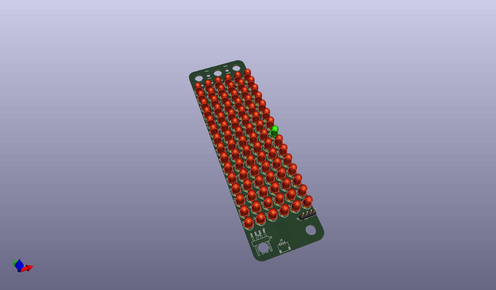
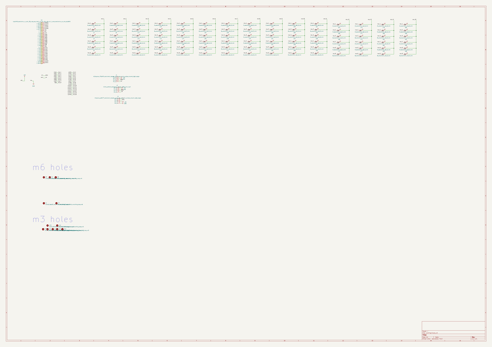
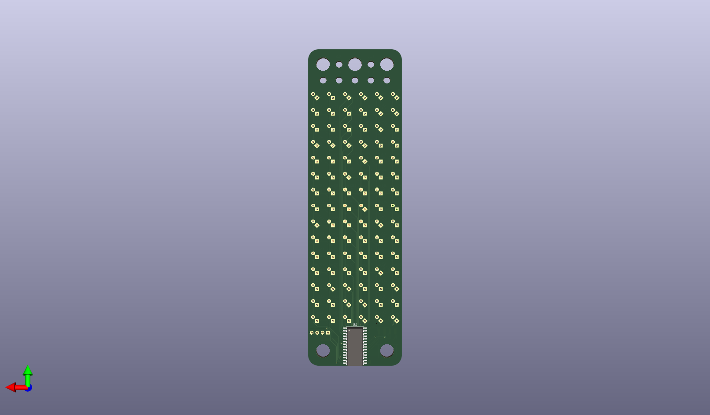
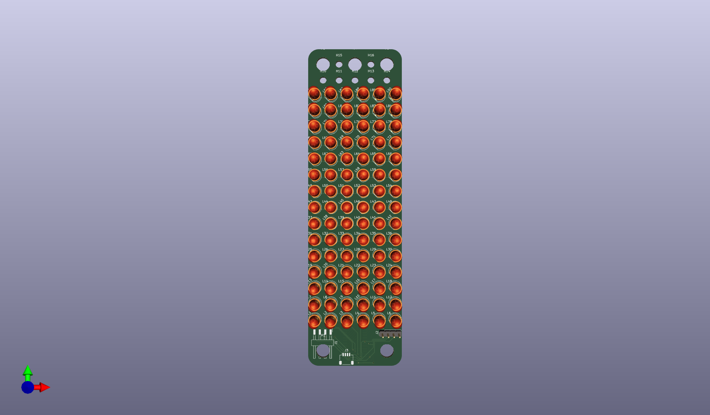

# None

## Description
None/
## Schematic

## Bill of Materials
| Id | Designator | Footprint | Quantity | Designation | Supplier and ref |  |
| --- | --- | --- | --- | --- | --- | --- |
| 1 | L74,L17,L88,L90,L10, L70,L80,L13,L9,L86,L 71,L69,L72,L63,L20,L 87,L58,L42,L16,L79,L 45,L38,L85,L1,L61,L8 9,L4,L50,L75,L3,L76, L27,L7,L64,L35,L12,L 65,L53,L60,L78,L23,L 41,L83,L2,L15,L6,L22 ,L48,L55,L66,L5,L34, L30,L59,L11,L46,L82, L19,L73,L44,L33,L21, L31,L25,L40,L24,L57, L43,L36,L77,L51,L8,L 49,L18,L14,L28,L37,L 81,L29,L52,L84,L56,L 32,L39,L26,L47,L62,L 68,L54,L67 | l5_7297cd_electronic _led_5_mm | 90 | [5 Mm Led](https://github.com/oomlout/oomlout_oomp_v3/tree/main/parts/electronic_led_5_mm) l5 7297cd |  |  |
| 2 | J3 | h4psmra_adfe77_elect ronic_header_1_mm_js t_sh_4_pin_surface_m ount_right_angle | 1 | [Jst Sh 4 Pin Surface Mount Right Angle Header 1 Mm Pitch](https://github.com/oomlout/oomlout_oomp_v3/tree/main/parts/electronic_header_1_mm_jst_sh_4_pin_surface_mount_right_angle) h4psmra adfe77 |  |  |
| 3 | J2 | hi14p_abf4a4_electro nic_header_2d54_mm_4 _pin | 1 | [0.1" 4 Pin Header](https://github.com/oomlout/oomlout_oomp_v3/tree/main/parts/electronic_header_2d54_mm_4_pin) hi14p abf4a4 |  |  |
| 4 | H13,H12,H10,H14,H15, H16,H11 | mhm3_872f01_electron ic_mounting_hole_m3 | 7 | [M3 Mounting Hole](https://github.com/oomlout/oomlout_oomp_v3/tree/main/parts/electronic_mounting_hole_m3) mhm3 872f01 |  |  |
| 5 | H2,H5,H4,H1,H3 | mhm6_fbea65_electron ic_mounting_hole_m6 | 5 | [M6 Mounting Hole](https://github.com/oomlout/oomlout_oomp_v3/tree/main/parts/electronic_mounting_hole_m6) mhm6 fbea65 |  |  |
| 6 | J1 | hi14psmra_70c043_ele ctronic_header_2d54_ mm_4_pin_surface_mou nt_right_angle | 1 | [0.1" 4 Pin Surface Mount Right Angle Header](https://github.com/oomlout/oomlout_oomp_v3/tree/main/parts/electronic_header_2d54_mm_4_pin_surface_mount_right_angle) hi14psmra 70c043 |  |  |
| 7 | REF** | oobb_10_03 | 1 | oobb_10_03 |  |  |
| 8 | U1 | iaip1640_fe0f02_elec tronic_ic_soic_28_wi de_led_matrix_driver _16_x_8_wuxi_i_core_ electronics_co_ltd_a ip1640 | 1 | [16x8 led matrix driver (aip1640)](https://github.com/oomlout/oomlout_oomp_v3/tree/main/parts/electronic_ic_soic_28_wide_led_matrix_driver_16_x_8_wuxi_i_core_electronics_co_ltd_aip1640) isoic28waip1640 fe0f02 |  |  |

## Images

