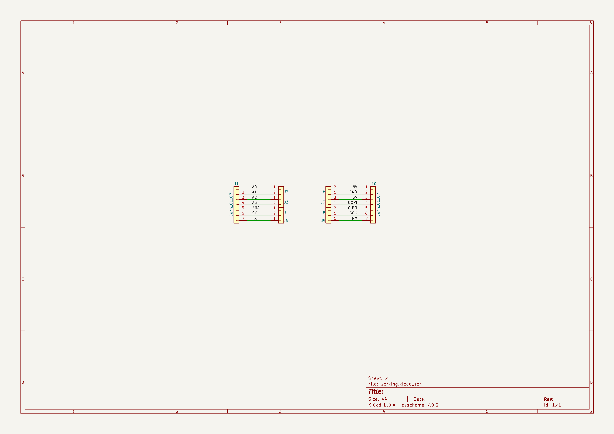
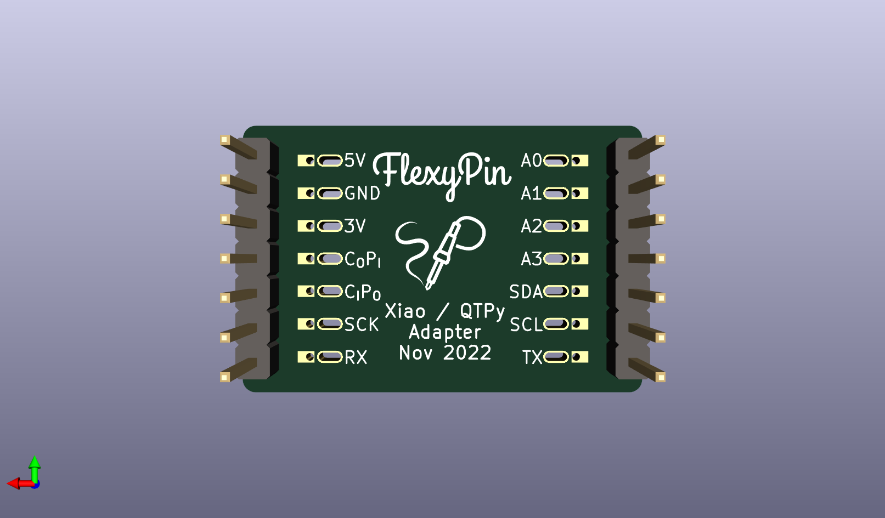

# None

## Description
None/
## Schematic

## Bill of Materials
| Id | Designator | Footprint | Quantity | Designation | Supplier and ref |  |
| --- | --- | --- | --- | --- | --- | --- |
| 1 | J4,J8,J7,J2,J3,J6 | FlexyPin_1x02_P2.54m m | 6 | Conn_01x02 |  |  |
| 2 | REF** | Fiducial_0.5mm_Mask1 .5mm | 1 | Fiducial_0.5mm_Mask1 .5mm |  |  |
| 3 | J5,J9 | FlexyPin_1x01_P2.54m m | 2 | Conn_01x01 |  |  |
| 4 | G***,G*** | SolderParty-New-Logo _7.5x6.4mm_SilkScree n | 2 | LOGO |  |  |
| 5 | J10,J1 | PinHeader_1x07_P2.54 mm_Vertical | 2 | Conn_01x07 |  |  |

## Images

