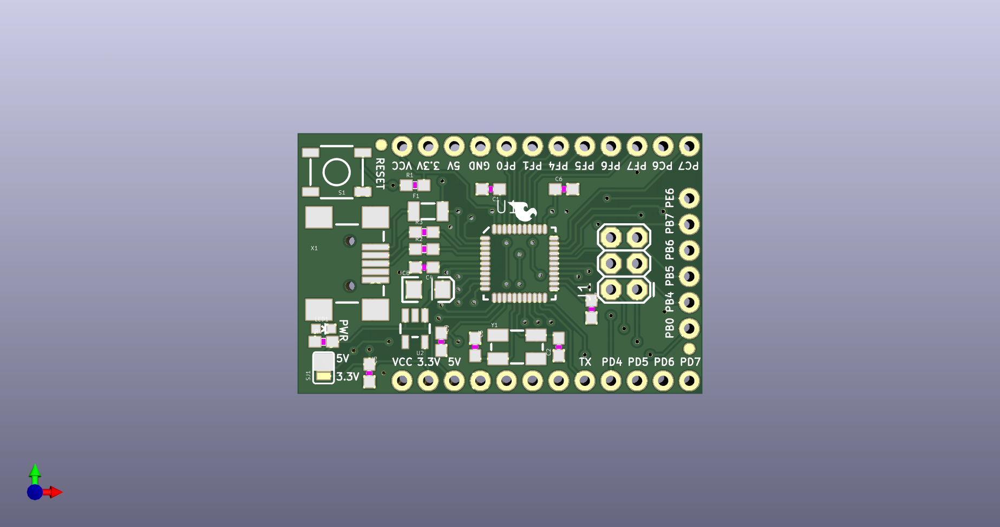

# None

## Description
None/
## Schematic

## Bill of Materials
| Id | Designator | Footprint | Quantity | Designation | Supplier and ref |  |
| --- | --- | --- | --- | --- | --- | --- |
| 1 | JP7,JP6 | FIDUCIAL-1X2 | 2 | FIDUCIAL1X2 |  |  |
| 2 | J1 | 2X3 | 1 | AVR_SPI_PRG |  |  |
| 3 | C6,C9,C1,C7 | 0603-CAP | 4 | 0.1uF |  |  |
| 4 | JP5 | SFE-LOGO-FLAME | 1 | LOGO-SFESK |  |  |
| 5 | C8 | EIA3216 | 1 | 10uF |  |  |
| 6 | R2,R3 | 0603-RES | 2 | 22 |  |  |
| 7 | C4,C5 | 0603-CAP | 2 | 1uF |  |  |
| 8 | X1 | USB-MINIB | 1 | USBSMD |  |  |
| 9 | R1 | 0603-RES | 1 | 10k |  |  |
| 10 | R4 | 0603-RES | 1 | 1k |  |  |
| 11 | C2,C3 | 0603-CAP | 2 | 18pF |  |  |
| 12 | U2 | SOT23-5 | 1 | 3.3V_REG_LDOSMD |  |  |
| 13 | U1 | QFN-44-NOPAD_1_1 | 1 | ATMEGA32U4 |  |  |
| 14 | LED1 | LED-0603 | 1 | Power |  |  |
| 15 | S1 | TACTILE_SWITCH_SMD | 1 | SWITCH-SMD |  |  |
| 16 | Y1 | CRYSTAL-SMD-5X3 | 1 | 16MHz |  |  |
| 17 | SJ1 | SJ_3_PASTE2&3 | 1 | Power Select |  |  |
| 18 | F1 | PTC-1206 | 1 | PTCSMD |  |  |
| 19 | JP8 | SFE-NEW-WEBLOGO | 1 | LOGO-SFENEW |  |  |
| 20 | JP3 | 1X06 | 1 |  |  |  |
| 21 | JP1,JP2 | 1X12 | 2 | M12PTH |  |  |
| 22 | U$6 | OSHW-LOGO-M | 1 | OSHW-LOGOM |  |  |

## Images

