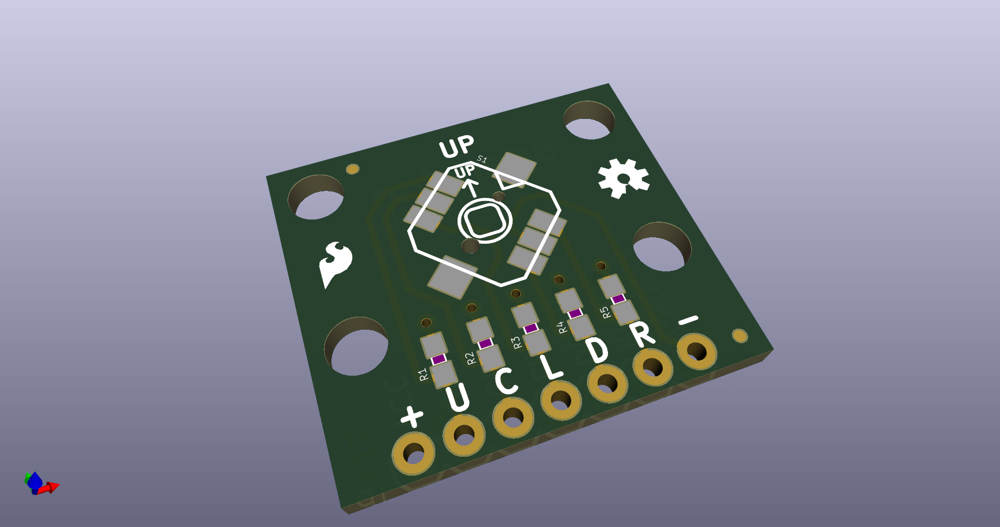
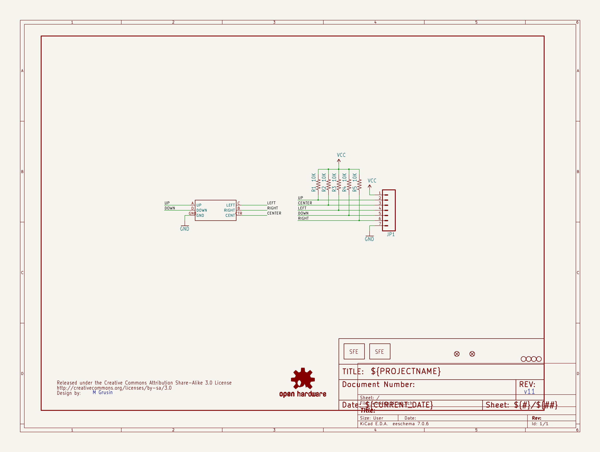
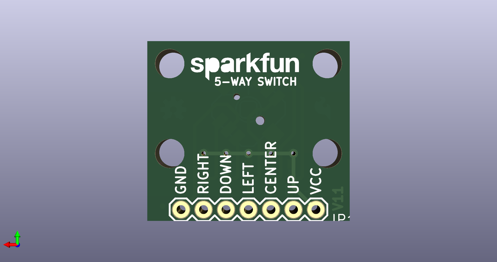
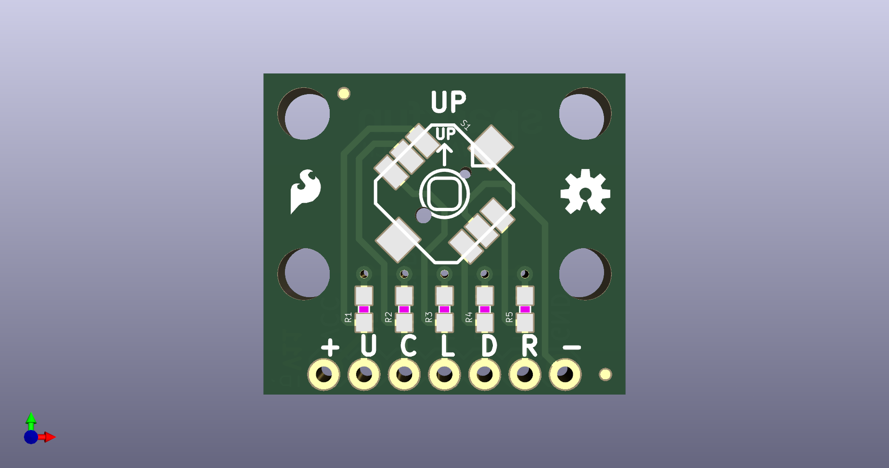

# None

## Description
None/
## Schematic

## Bill of Materials
| Id | Designator | Footprint | Quantity | Designation | Supplier and ref |  |
| --- | --- | --- | --- | --- | --- | --- |
| 1 | JP7,JP2 | MICRO-FIDUCIAL | 2 | FIDUCIALUFIDUCIAL |  |  |
| 2 | R3,R1,R2,R5,R4 | 0603-RES | 5 | 10K |  |  |
| 3 | U$1 | OSHW-LOGO-S | 1 | OSHW-LOGOS |  |  |
| 4 | U$2 | CREATIVE_COMMONS | 1 | CREATIVE_COMMONS |  |  |
| 5 | JP5,JP6,JP3,JP4 | STAND-OFF | 4 | STAND-OFF |  |  |
| 6 | JP9 | SFE-LOGO-FLAME | 1 | LOGO-SFESK |  |  |
| 7 | S1 | JOYSTICK_MINI | 1 | 5-WAY-TACTILE-SWITCH |  |  |
| 8 | JP1 | 1X07 | 1 |  |  |  |
| 9 | JP10 | SFE-NEW-WEB | 1 | LOGO-SFENW2 |  |  |

## Images

