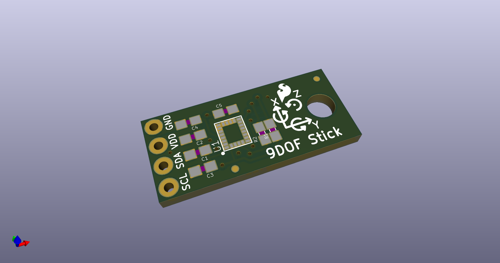
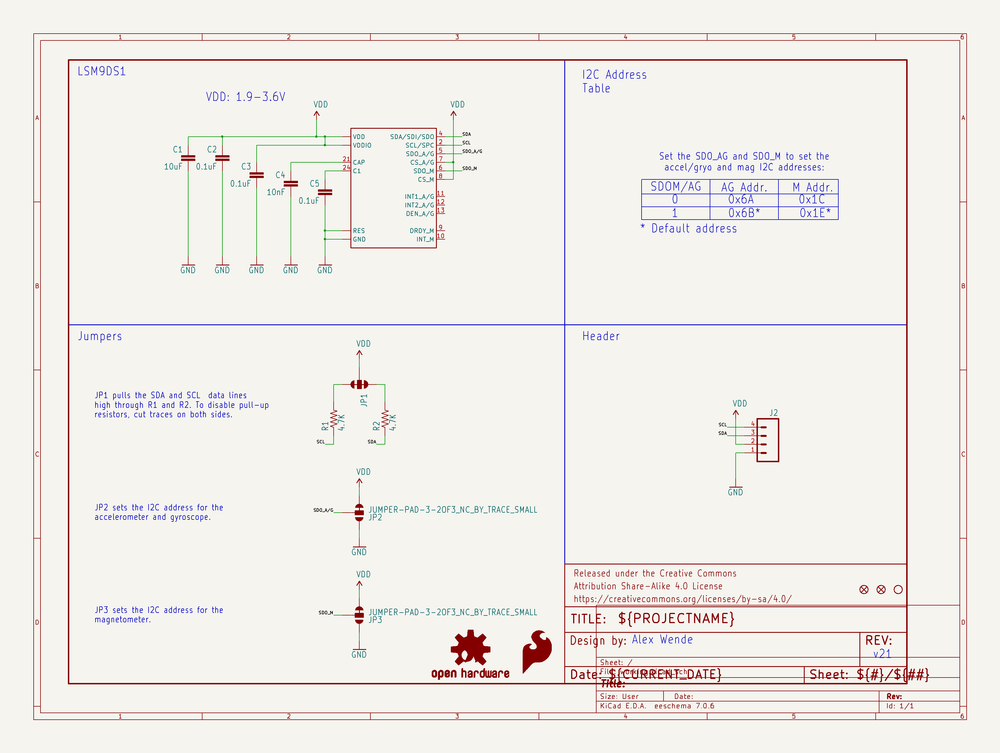
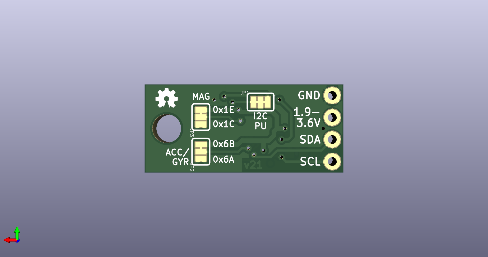
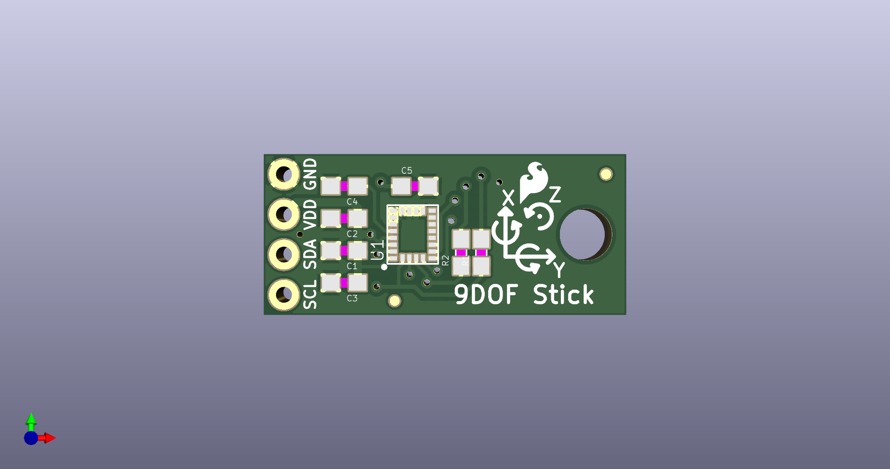

# None

## Description
None/
## Schematic

## Bill of Materials
| Id | Designator | Footprint | Quantity | Designation | Supplier and ref |  |
| --- | --- | --- | --- | --- | --- | --- |
| 1 | R2,R1 | 0603-RES | 2 | 4.7K |  |  |
| 2 | C3,C2,C5 | 0603-CAP | 3 | 0.1uF |  |  |
| 3 | FRAME1 | CREATIVE_COMMONS | 1 | FRAME-LETTER |  |  |
| 4 | FD3,FD4 | MICRO-FIDUCIAL | 2 | FIDUCIALUFIDUCIAL |  |  |
| 5 | LOGO1 | SFE_LOGO_FLAME_.1 | 1 | SFE_LOGO_FLAME.1_INC H |  |  |
| 6 | U1 | LGA24-8X4 | 1 | LSM9DS1 |  |  |
| 7 | J2 | 1X04_NO_SILK_ALL_ROU ND | 1 |  |  |  |
| 8 | C1 | 0603-CAP | 1 | 10uF |  |  |
| 9 | C4 | 0603-CAP | 1 | 10nF |  |  |
| 10 | H1 | STAND-OFF | 1 | STAND-OFF |  |  |
| 11 | LOGO3 | OSHW-LOGO-MINI | 1 | OSHW-LOGOMINI |  |  |
| 12 | JP1 | PAD-JUMPER-3-3OF3_NC _BY_TRACE_YES_SILK_F ULL_BOX | 1 |  |  |  |
| 13 | JP3,JP2 | PAD-JUMPER-3-2OF3_NC _BY_TRACE_YES_SILK_F ULL_BOX | 2 |  |  |  |

## Images

