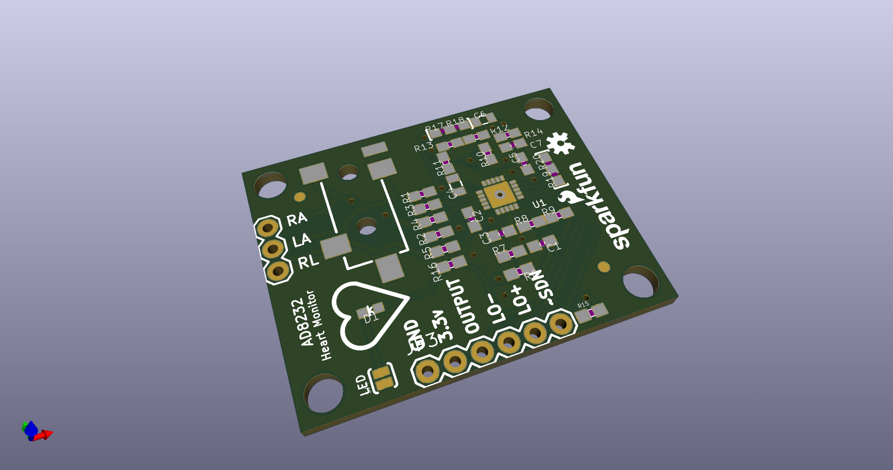
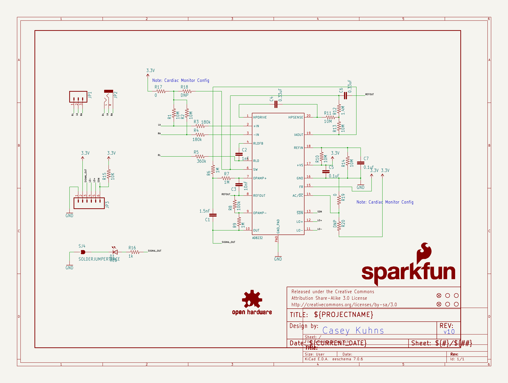
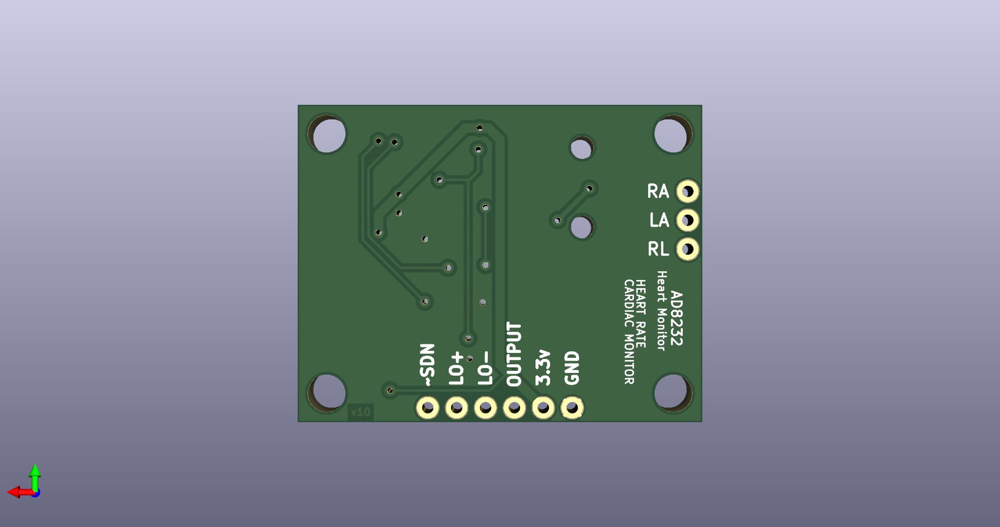
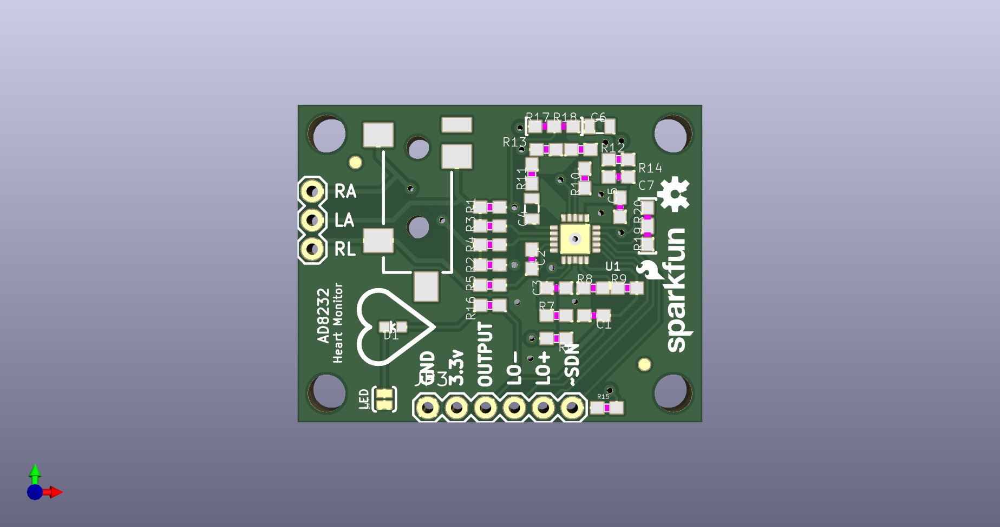

# None

## Description
None/
## Schematic

## Bill of Materials
| Id | Designator | Footprint | Quantity | Designation | Supplier and ref |  |
| --- | --- | --- | --- | --- | --- | --- |
| 1 | JP3 | 1X06 | 1 |  |  |  |
| 2 | C1 | 0603-CAP | 1 | 1.5nF |  |  |
| 3 | STANDOFF1,STANDOFF4, STANDOFF3,STANDOFF2 | STAND-OFF | 4 | STAND-OFF |  |  |
| 4 | LOGO2 | SFE_LOGO_NAME_FLAME_ .1 | 1 | SFE_LOGO_NAME_FLAME. 1_INCH |  |  |
| 5 | U1 | LFCSP_20 | 1 | AD8232 |  |  |
| 6 | FRAME1 | CREATIVE_COMMONS | 1 | FRAME-LETTER |  |  |
| 7 | C7 | 0603-CAP | 1 | 0.1uf |  |  |
| 8 | R2,R13,R1,R14,R11,R1 0 | 0603-RES | 6 | 10M |  |  |
| 9 | R6,R7,R9 | 0603-RES | 3 | 1M |  |  |
| 10 | FID1,FID2 | FIDUCIAL-1X2 | 2 | FIDUCIAL1X2 |  |  |
| 11 | R3,R4 | 0603-RES | 2 | 180k |  |  |
| 12 | SJ4 | SJ_2S-TRACE | 1 | LED DISABLE |  |  |
| 13 | R15 | 0603-RES | 1 | 10K |  |  |
| 14 | R5 | 0603-RES | 1 | 360k |  |  |
| 15 | R18,R20 | 0603 | 2 | DNP |  |  |
| 16 | R8 | 0603-RES | 1 | 100k |  |  |
| 17 | C4,C6 | 0805 | 2 | 0.33uF |  |  |
| 18 | D1 | LED-0603 | 1 | RED |  |  |
| 19 | R16 | 0603-RES | 1 | 1k |  |  |
| 20 | C3 | 0603-CAP | 1 | 10nF |  |  |
| 21 | LOGO1 | OSHW-LOGO-S | 1 | OSHW-LOGOS |  |  |
| 22 | C5 | 0603-CAP | 1 | 0.1uF |  |  |
| 23 | JP2 | AUDIO-JACK-3.5MM-SMD | 1 |  |  |  |
| 24 | R12 | 0603-RES | 1 | 1.4M |  |  |
| 25 | R17,R19 | 0603 | 2 | 0 |  |  |
| 26 | C2 | 0603-CAP | 1 | 1nF |  |  |
| 27 | JP1 | 1X03 | 1 |  |  |  |

## Images

