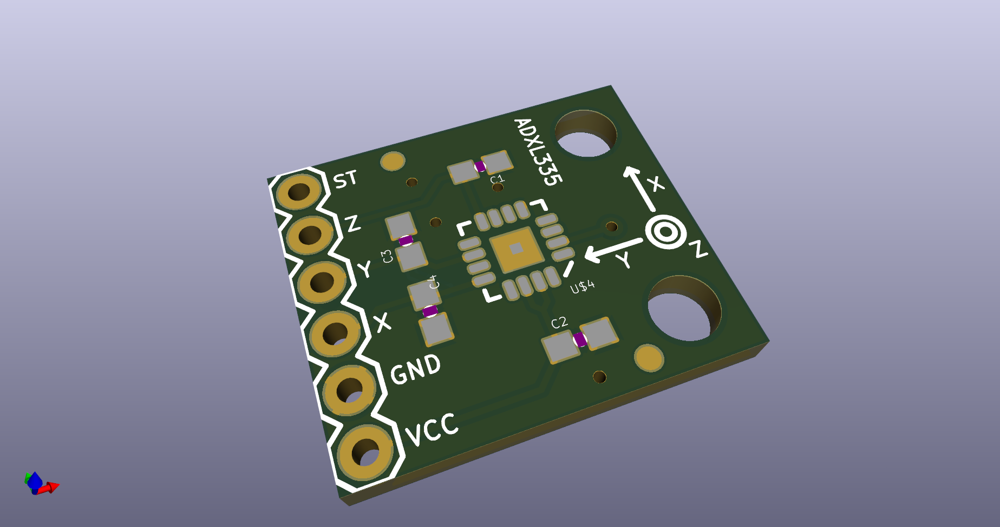
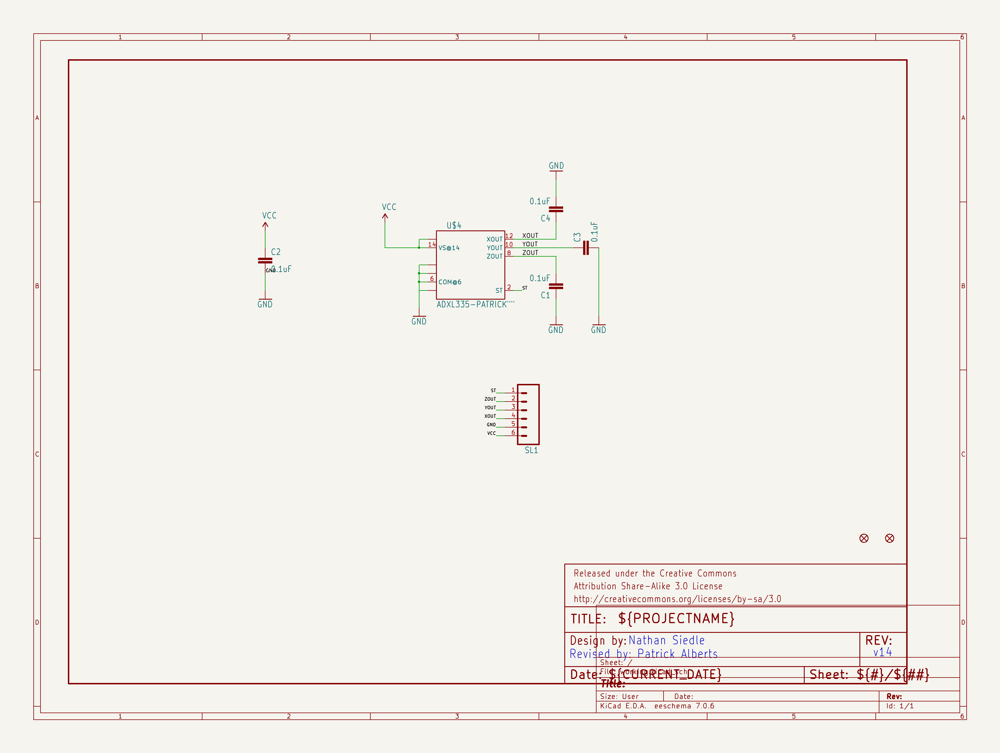
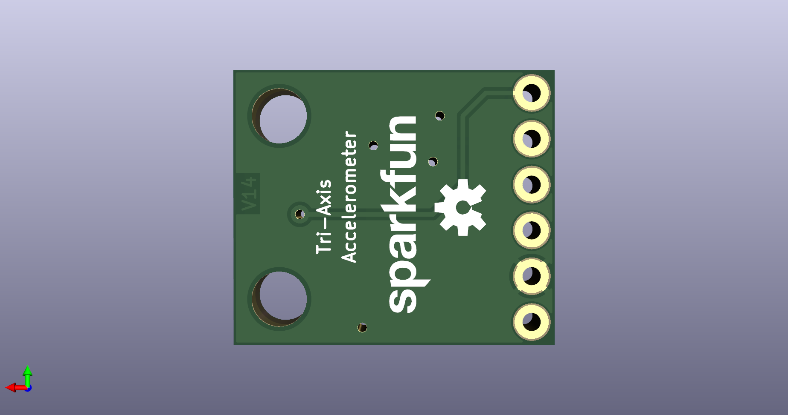
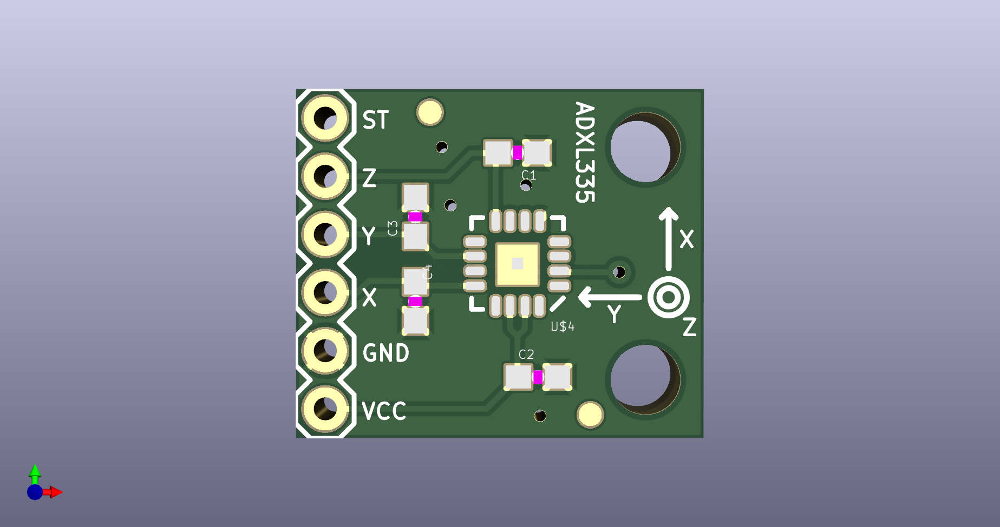

# None

## Description
None/
## Schematic

## Bill of Materials
| Id | Designator | Footprint | Quantity | Designation | Supplier and ref |  |
| --- | --- | --- | --- | --- | --- | --- |
| 1 | C4,C3,C1,C2 | 0603-CAP | 4 | 0.1uF |  |  |
| 2 | U$7,U$6 | STAND-OFF-TIGHT | 2 |  |  |  |
| 3 | U$3,U$1 | FIDUCIAL-1X2 | 2 | FIDUCIAL1X2 |  |  |
| 4 | U$4 | ADXL335-P | 1 | ADXL335-PATRICK" |  |  |
| 5 | SL1 | 1X06 | 1 |  |  |  |
| 6 | U$8 | SFE_LOGO_NAME_.1 | 1 |  |  |  |
| 7 | U$5 | OSHW-LOGO-S | 1 |  |  |  |

## Images

