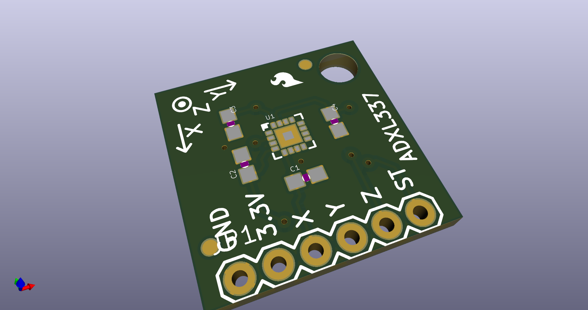
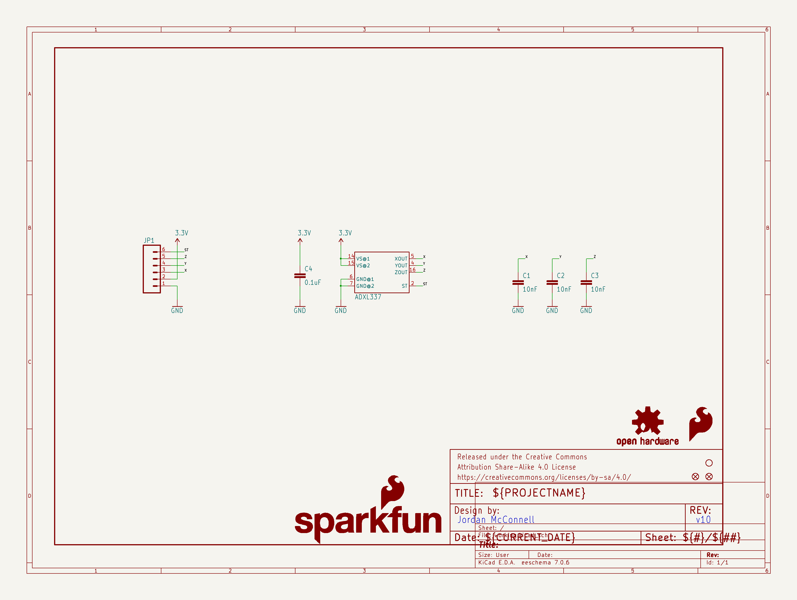
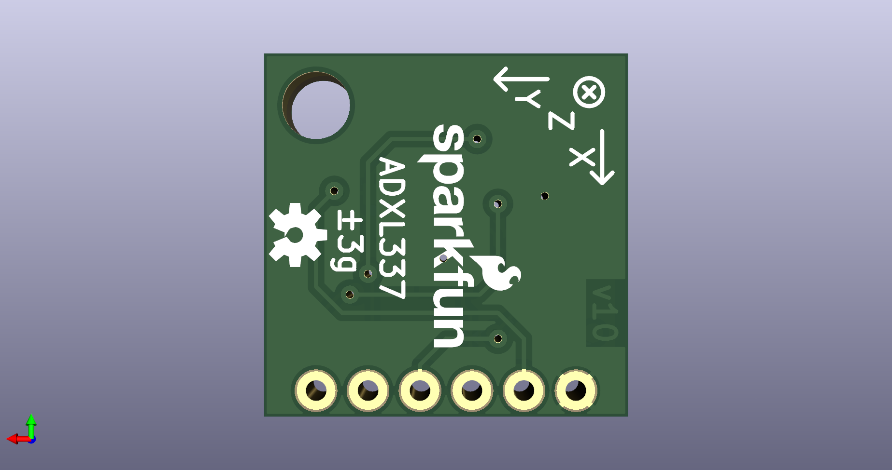
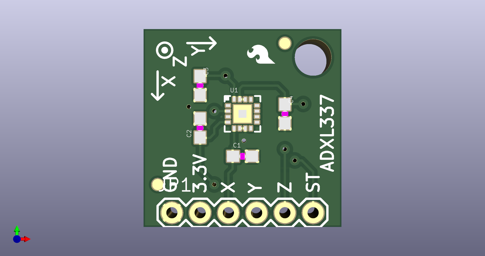

# None

## Description
None/
## Schematic

## Bill of Materials
| Id | Designator | Footprint | Quantity | Designation | Supplier and ref |  |
| --- | --- | --- | --- | --- | --- | --- |
| 1 | C4 | 0603-CAP | 1 | 0.1uF |  |  |
| 2 | FID1,FID2 | FIDUCIAL-1X2 | 2 | FIDUCIAL1X2 |  |  |
| 3 | FRAME1 | CREATIVE_COMMONS | 1 | FRAME-LETTER |  |  |
| 4 | LOGO1 | SFE_LOGO_FLAME_.1 | 1 | SFE_LOGO_FLAME.1_INC H |  |  |
| 5 | C3,C1,C2 | 0603-CAP | 3 | 10nF |  |  |
| 6 | JP1 | 1X06 | 1 |  |  |  |
| 7 | STANDOFF1 | STAND-OFF | 1 | STAND-OFF |  |  |
| 8 | U1 | LFCSP_LQ-16 | 1 | ADXL337 |  |  |
| 9 | LOGO3 | SFE_LOGO_NAME_FLAME_ .1 | 1 | SFE_LOGO_NAME_FLAME. 1_INCH |  |  |
| 10 | LOGO2 | OSHW-LOGO-S | 1 | OSHW-LOGOS |  |  |

## Images

