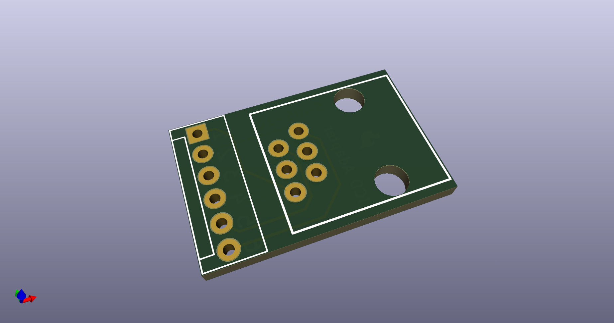
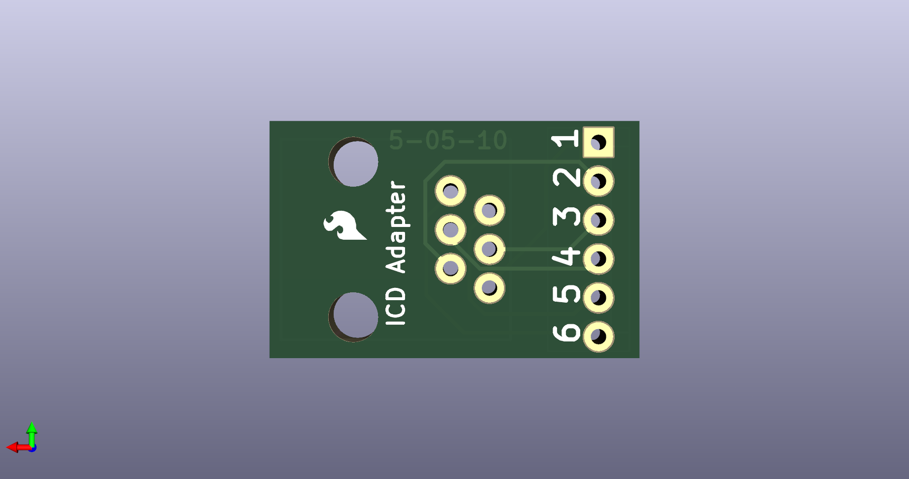
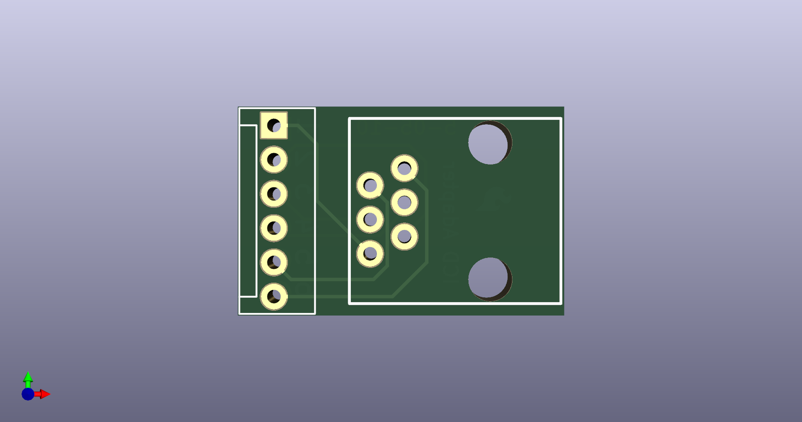

# None

## Description
None/
## Schematic

## Bill of Materials
| Id | Designator | Footprint | Quantity | Designation | Supplier and ref |  |
| --- | --- | --- | --- | --- | --- | --- |
| 1 | RJ11 | RJ11-6 | 1 | RJ11-6PTH |  |  |
| 2 | FRAME1 | DUMMY | 1 |  |  |  |
| 3 | HEADERS0 | MOLEX-1X6 | 1 |  |  |  |
| 4 | JP1 | SFE-LOGO-FLAME | 1 | LOGO-SFESK |  |  |

## Images

