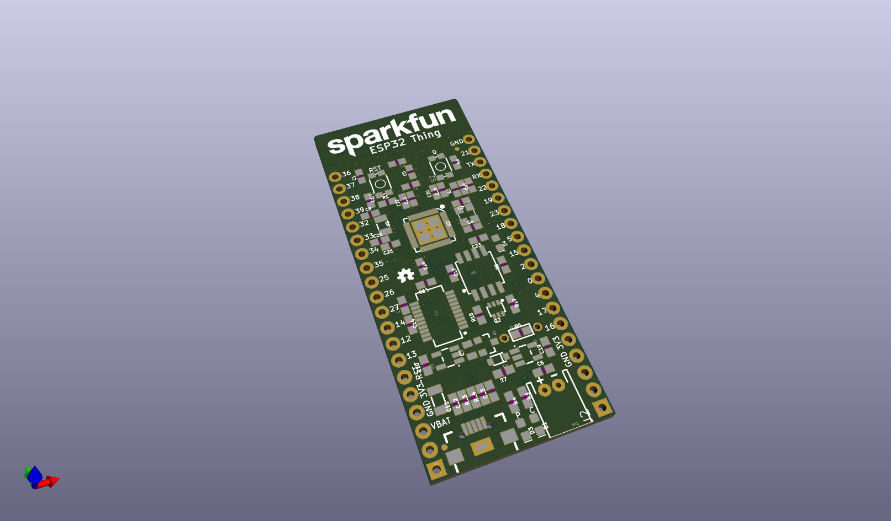
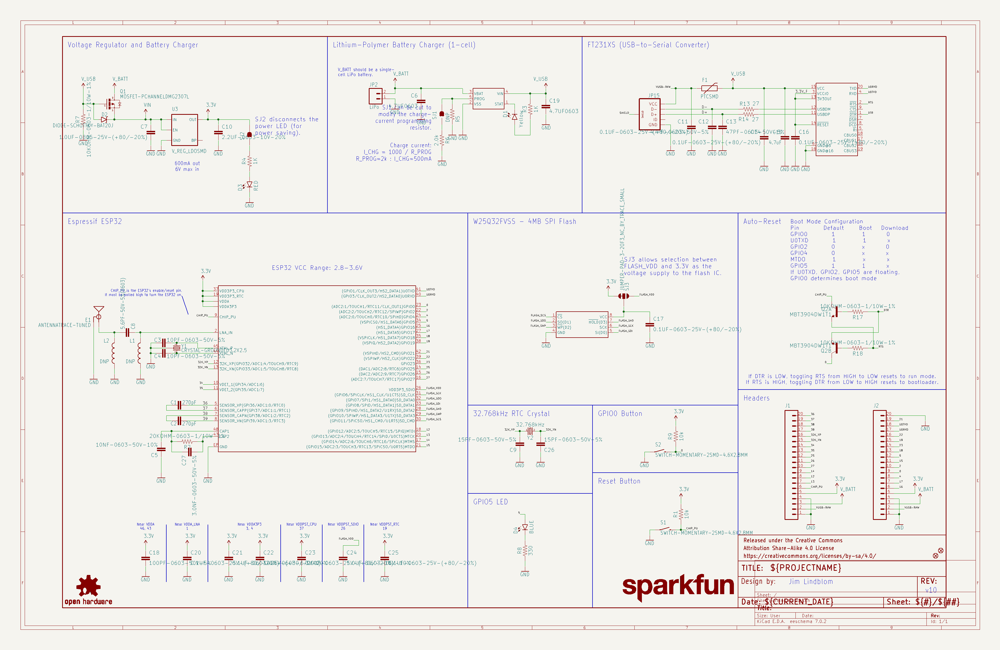
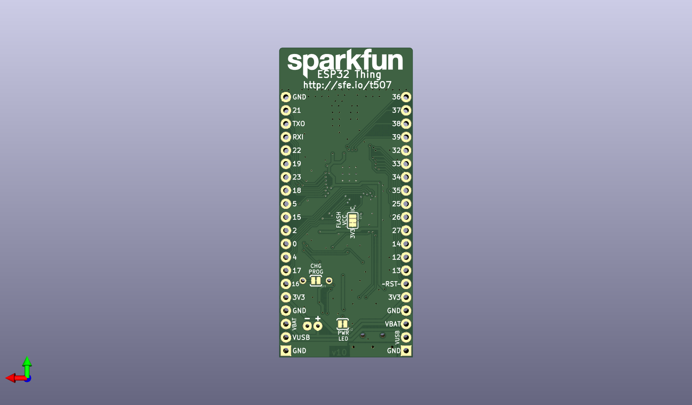
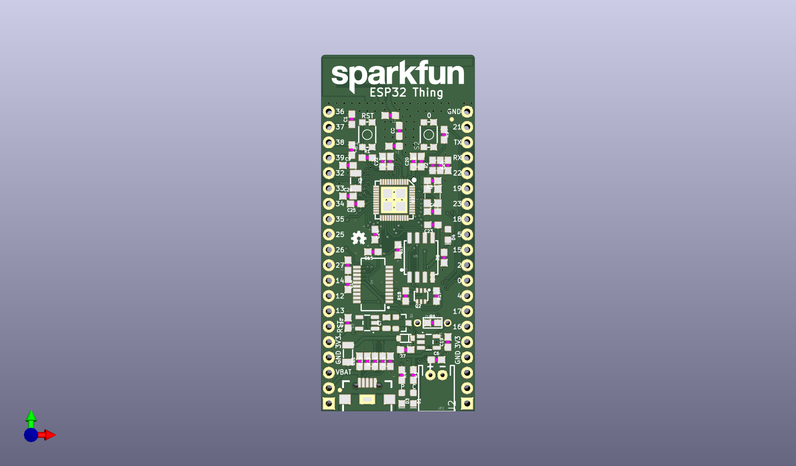

# None

## Description
None/
## Schematic

## Bill of Materials
| Id | Designator | Footprint | Quantity | Designation | Supplier and ref |  |
| --- | --- | --- | --- | --- | --- | --- |
| 1 | R3,R4 | 0603 | 2 | 1K |  |  |
| 2 | U5 | SOIC-8 | 1 | W25Q32FVSS |  |  |
| 3 | C10 | 0603 | 1 | 2.2uF |  |  |
| 4 | R1,R9,R17,R7,R18 | 0603 | 5 | 10k |  |  |
| 5 | JP15 | USB-B-MICRO-SMD_V03 | 1 |  |  |  |
| 6 | R14,R13 | 0603 | 2 | 27 |  |  |
| 7 | C20,C14,C25,C17,C16, C23,C11,C21 | 0603 | 8 | 0.1uF |  |  |
| 8 | C13,C12 | 0603 | 2 | 47pF |  |  |
| 9 | C8 | 0603 | 1 | 5.6pF |  |  |
| 10 | C26,C9 | 0603 | 2 | 15pF |  |  |
| 11 | C1,C2 | 0603 | 2 | 270pF |  |  |
| 12 | C19,C6 | 0603 | 2 | 4.7uF |  |  |
| 13 | C18 | 0603 | 1 | 100pF |  |  |
| 14 | L2,L1 | 0603 | 2 | DNP |  |  |
| 15 | J1,J2 | 1X20_NOSILK | 2 |  |  |  |
| 16 | R5 | 1_6W-RES | 1 | DNP |  |  |
| 17 | C3,C4 | 0603 | 2 | 10pF |  |  |
| 18 | Y2 | CRYSTAL-SMD-3.2X1.5M M | 1 | 32.768kHz |  |  |
| 19 | C22 | 0603 | 1 | 10uF |  |  |
| 20 | Q1 | SOT23-3 | 1 | 2.5A/30V |  |  |
| 21 | C15 | 0603-CAP | 1 | 4.7uF |  |  |
| 22 | C27 | 0603 | 1 | 3.0nF |  |  |
| 23 | U1 | SOT23-5 | 1 | MCP73831 |  |  |
| 24 | S2 | TACTILE_SWITCH_SMD_4 .6X2.8MM | 1 | BTN-0 |  |  |
| 25 | FD2,FD1 | MICRO-FIDUCIAL | 2 | FIDUCIALUFIDUCIAL |  |  |
| 26 | D4 | LED-0603 | 1 | BLUE |  |  |
| 27 | F1 | PTC-1206 | 1 | 500mA |  |  |
| 28 | C7 | 0805 | 1 | 1.0uF |  |  |
| 29 | U3 | SOT23-5 | 1 | AP2112K-3.3V |  |  |
| 30 | R2 | 0603 | 1 | 20k |  |  |
| 31 | E1 | TRACE_ANTENNA_2.4GHZ _25.7MM_TUNED | 1 | ANTENNA |  |  |
| 32 | D3 | LED-0603 | 1 | RED |  |  |
| 33 | Q2 | SC70-6 | 1 | MBT3904DW1T1 |  |  |
| 34 | LOGO2 | OSHW-LOGO-MINI | 1 | OSHW-LOGOMINI |  |  |
| 35 | D1 | LED-0603 | 1 | Yellow |  |  |
| 36 | R8 | 0603 | 1 | 330 |  |  |
| 37 | S1 | TACTILE_SWITCH_SMD_4 .6X2.8MM | 1 | RESET |  |  |
| 38 | U4 | SSOP20_L | 1 | FT231XS |  |  |
| 39 | U2 | QFN48-0.4MM | 1 | ESP3212 |  |  |
| 40 | JP2 | JST-2-PTH | 1 | LiPo |  |  |
| 41 | Y1 | CRYSTAL-SMD-3.2X2.5 | 1 | 26MHz |  |  |
| 42 | FRAME1 | CREATIVE_COMMONS | 1 | FRAME-LEDGER |  |  |
| 43 | R6 | 0603 | 1 | 2.0k |  |  |
| 44 | LOGO1,LOGO3 | SFE_LOGO_NAME_.2 | 2 | SFE_LOGO_NAME.2_INCH |  |  |
| 45 | C24 | 0603 | 1 | 1.0uF |  |  |
| 46 | C5 | 0603 | 1 | 10nF |  |  |
| 47 | D2 | SOD-323 | 1 | BAT20J |  |  |
| 48 | SJ3 | PAD-JUMPER-3-2OF3_NC _BY_TRACE_YES_SILK_F ULL_BOX | 1 |  |  |  |
| 49 | SJ1,SJ2 | PAD-JUMPER-2-NC_BY_T RACE_YES_SILK | 2 | JUMPER-PAD-2-NC_BY_T RACE |  |  |

## Images

