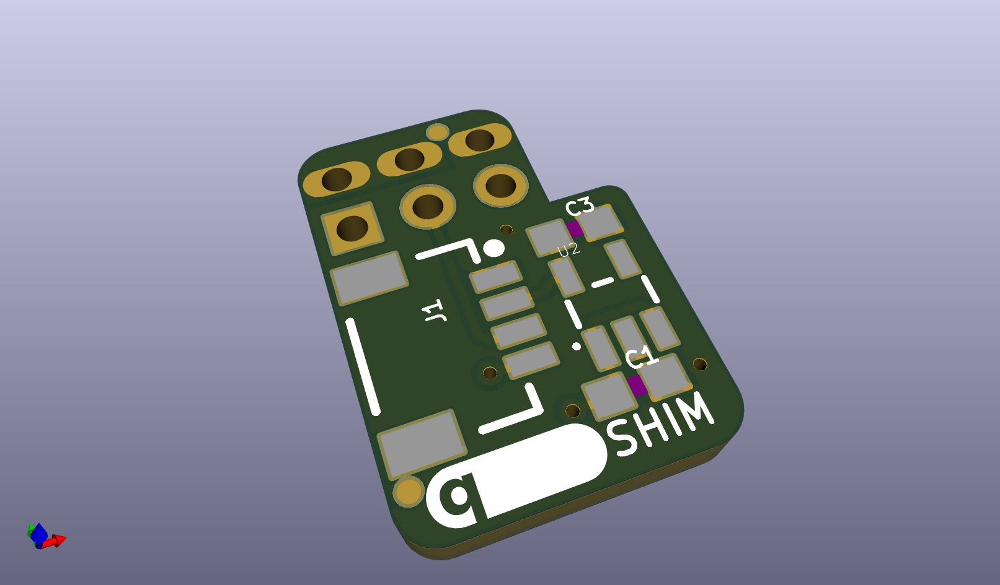
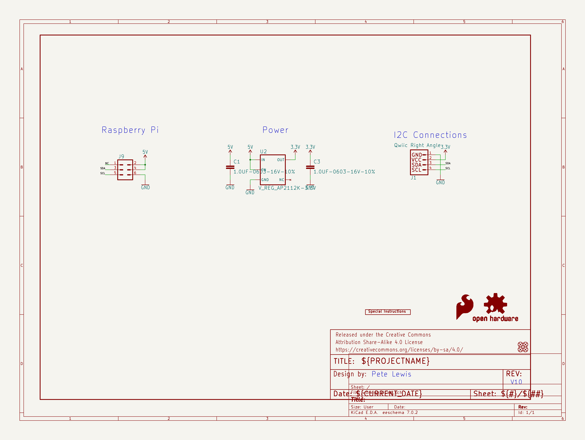
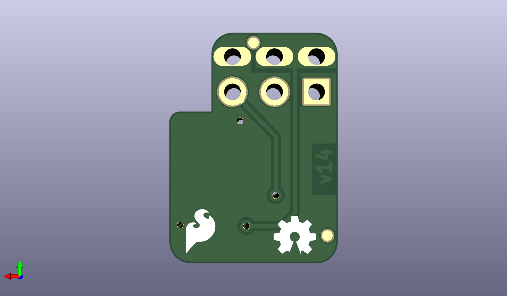
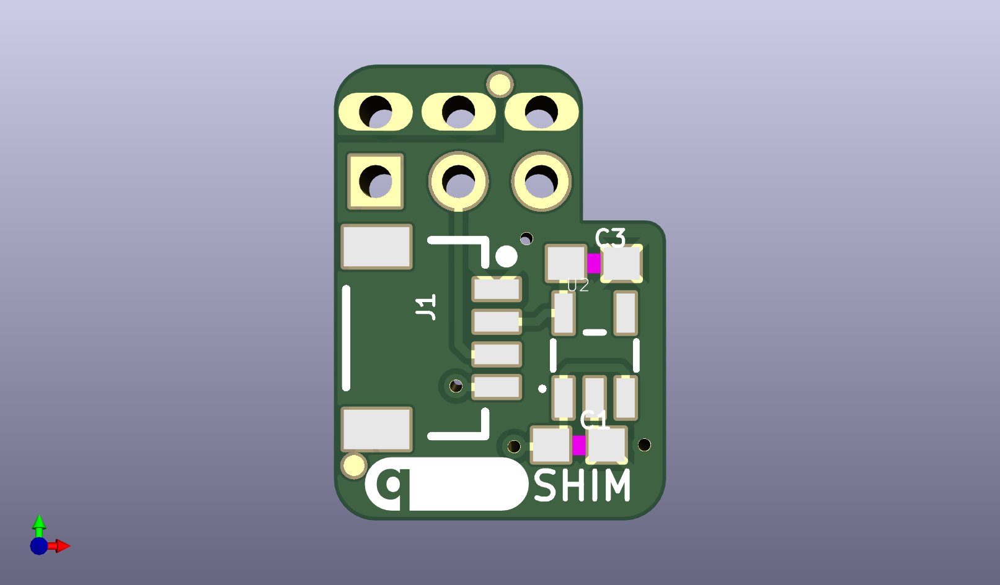

# None

## Description
None/
## Schematic

## Bill of Materials
| Id | Designator | Footprint | Quantity | Designation | Supplier and ref |  |
| --- | --- | --- | --- | --- | --- | --- |
| 1 | FRAME1 | CREATIVE_COMMONS | 1 | FRAME-LETTER |  |  |
| 2 | U$3 | QWIIC_5MM | 1 |  |  |  |
| 3 | J1 | 1X04_1MM_RA | 1 | Qwiic Right Angle |  |  |
| 4 | C1,C3 | 0603 | 2 | 1.0uF |  |  |
| 5 | U2 | SOT23-5 | 1 | 3.3V/600mA |  |  |
| 6 | J9 | SPARKFUN-CONNECTORS_ 2X3-NS_PISHIM_LOCKIN G_SLOTS-4MILS | 1 |  |  |  |
| 7 | U$4 | ORDERING_INSTRUCTION S | 1 | SPECIAL_INSTRUCTIONS -ORDERING |  |  |
| 8 | FD1,FD2,FD4,FD3 | FIDUCIAL-MICRO | 4 | FIDUCIALUFIDUCIAL |  |  |
| 9 | U$1 | SFE_LOGO_FLAME_.1 | 1 | SFE_LOGO_FLAME.1_INC H |  |  |
| 10 | LOGO1 | OSHW-LOGO-MINI | 1 | OSHW-LOGOMINI |  |  |

## Images

