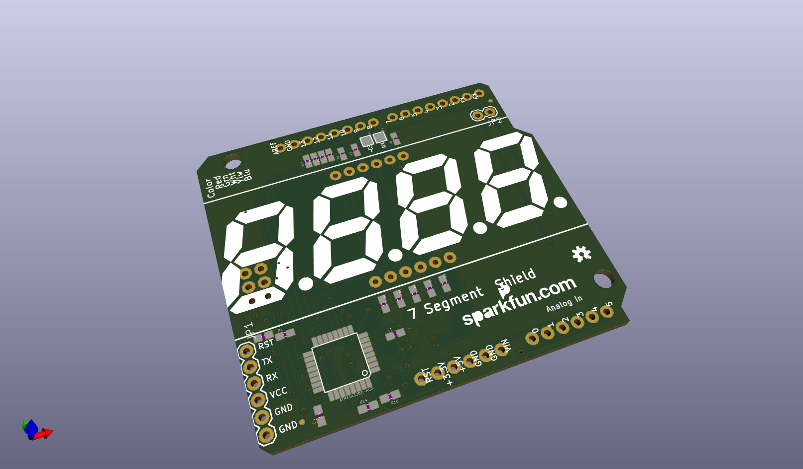
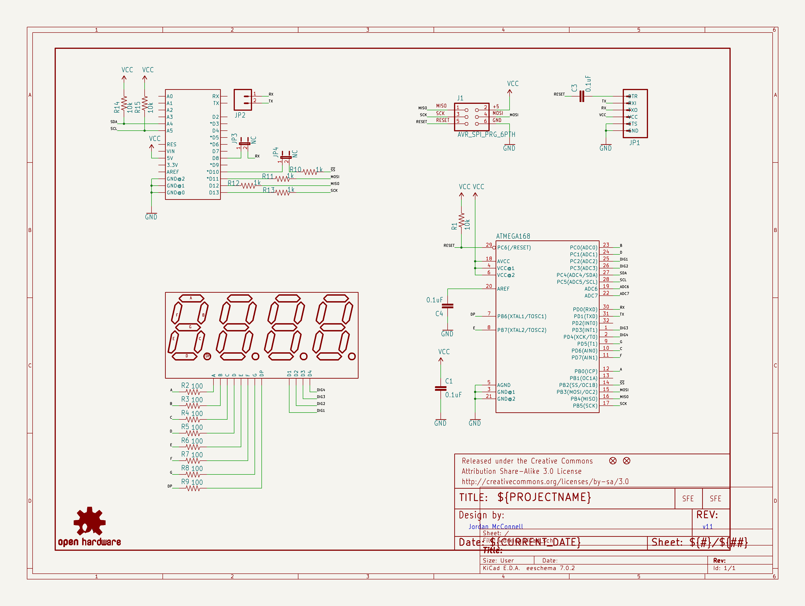
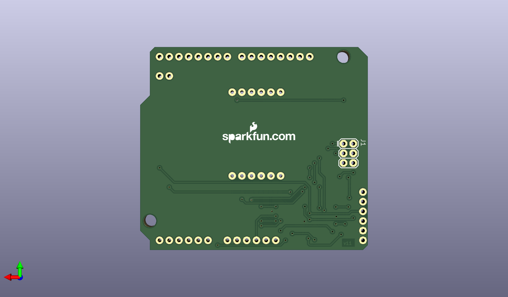
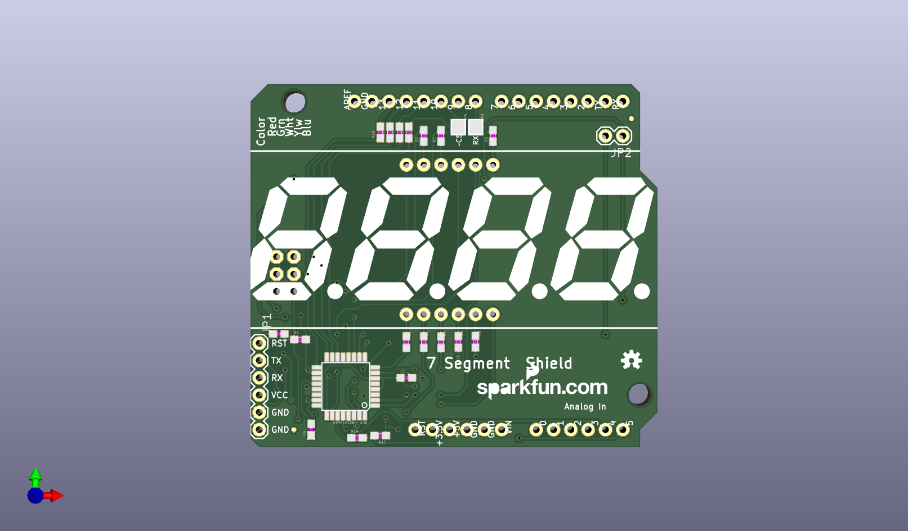

# None

## Description
None/
## Schematic

## Bill of Materials
| Id | Designator | Footprint | Quantity | Designation | Supplier and ref |  |
| --- | --- | --- | --- | --- | --- | --- |
| 1 | JP3,JP4 | SJ_2S | 2 | NC |  |  |
| 2 | JP9,JP10 | MICRO-FIDUCIAL | 2 | FIDUCIALUFIDUCIAL |  |  |
| 3 | FRAME1 | CREATIVE_COMMONS | 1 | FRAME-LETTER |  |  |
| 4 | R9,R4,R2,R7,R5,R8,R6 ,R3 | 0603-RES | 8 | 100 |  |  |
| 5 | U$1 | 7-SEGMENT-4DIGIT-COU NTER | 1 | 7-SEGMENT-4DIGIT-COU NTERPTH |  |  |
| 6 | R11,R10,R12,R13 | 0603-RES | 4 | 1k |  |  |
| 7 | U1 | DUEMILANOVE_SHIELD | 1 | ARDUINO_SHIELDLABEL |  |  |
| 8 | C1,C4,C3 | 0603-CAP | 3 | 0.1uF |  |  |
| 9 | U$4 | OSHW-LOGO-S | 1 | OSHW-LOGOS |  |  |
| 10 | LOGO1,LOGO2 | SFE-NEW-WEBLOGO | 2 | LOGO-SFENEW |  |  |
| 11 | R14,R1,R15 | 0603-RES | 3 | 10k |  |  |
| 12 | ATMEGA328P-AU0 | TQFP32-08 | 1 | ATMEGA328P-AU |  |  |
| 13 | JP1 | 1X06 | 1 |  |  |  |
| 14 | JP2 | 1X02 | 1 |  |  |  |
| 15 | J1 | 2X3 | 1 | AVR_SPI_PRG_6PTH |  |  |

## Images

