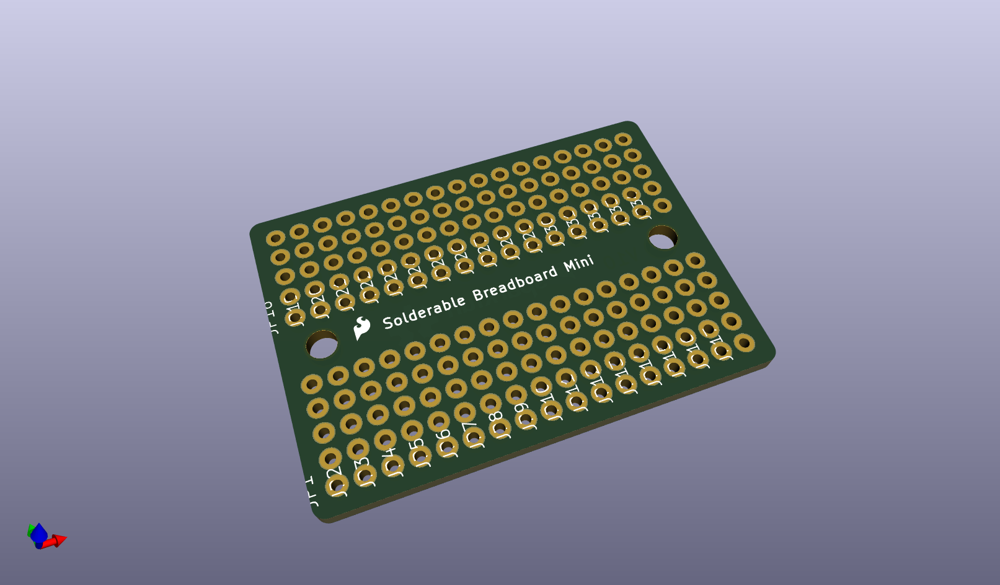
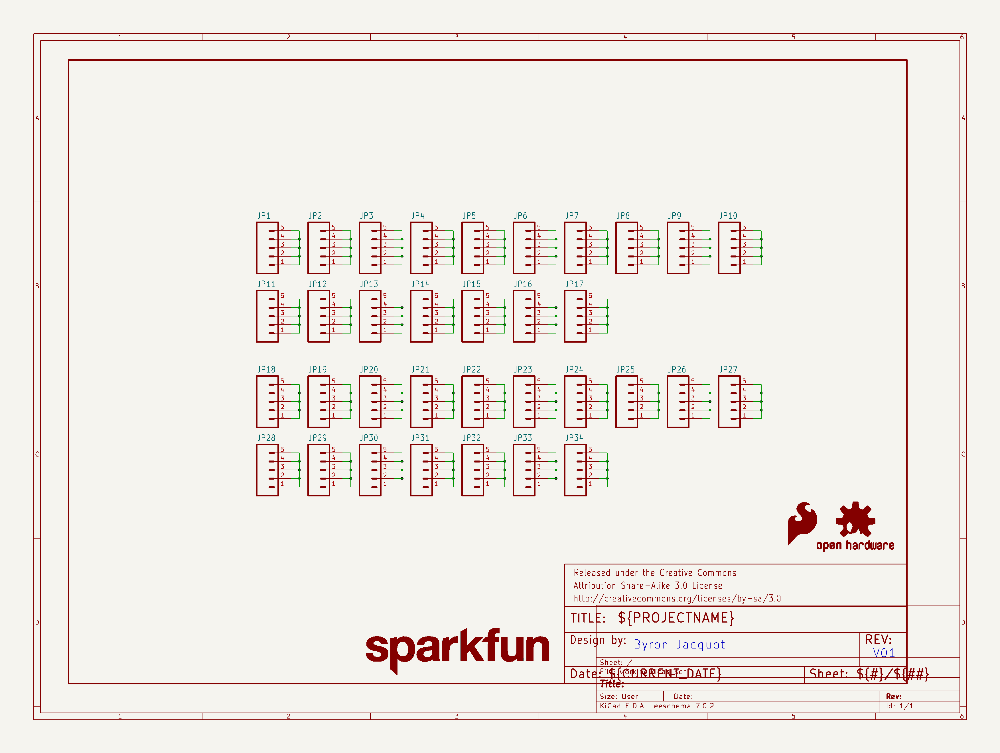
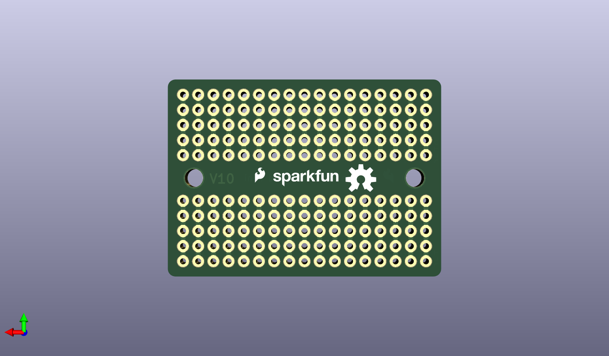
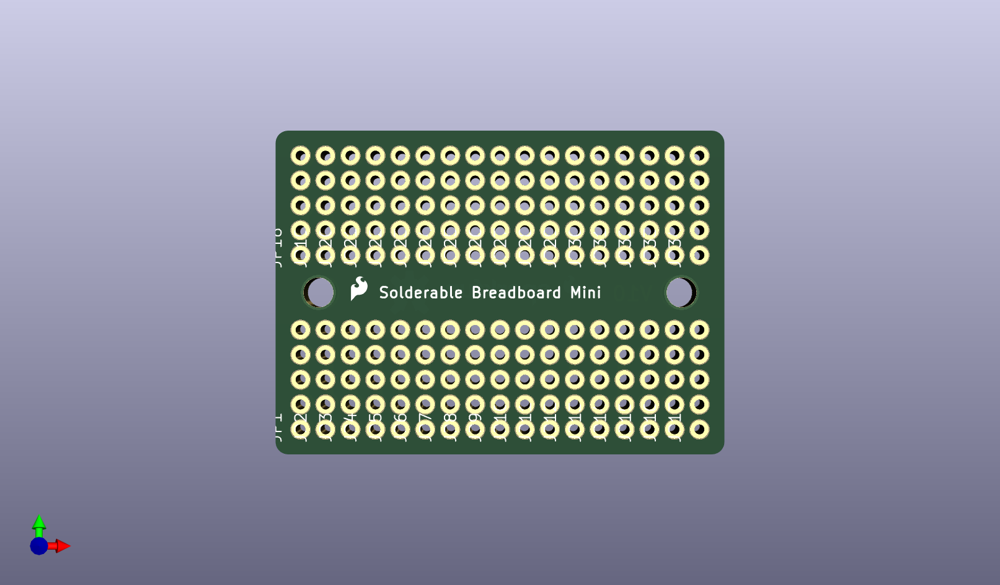

# None

## Description
None/
## Schematic

## Bill of Materials
| Id | Designator | Footprint | Quantity | Designation | Supplier and ref |  |
| --- | --- | --- | --- | --- | --- | --- |
| 1 | JP10,JP5,JP18,JP33,J P23,JP30,JP27,JP28,J P2,JP17,JP4,JP16,JP9 ,JP3,JP12,JP19,JP34, JP14,JP32,JP8,JP29,J P11,JP6,JP7,JP25,JP2 6,JP31,JP20,JP24,JP2 1,JP15,JP1,JP13,JP22 | 1X05_NO_SILK | 34 |   |  |  |
| 2 | LOGO3,LOGO4 | SFE_LOGO_FLAME_.1 | 2 | SFE_LOGO_FLAME.1_INC H |  |  |
| 3 | FRAME1 | CREATIVE_COMMONS | 1 | FRAME-LETTER |  |  |
| 4 | LOGO1 | SFE_LOGO_NAME_.1 | 1 | SFE_LOGO_NAME.1_INCH |  |  |
| 5 | LOGO2 | OSHW-LOGO-M | 1 | OSHW-LOGOM |  |  |

## Images

