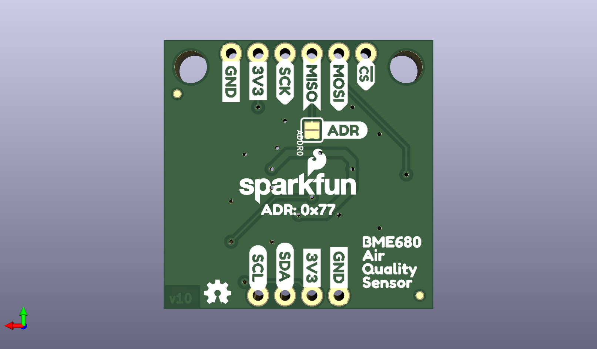

# None

## Description
None/
## Schematic

## Bill of Materials
| Id | Designator | Footprint | Quantity | Designation | Supplier and ref |  |
| --- | --- | --- | --- | --- | --- | --- |
| 1 | U$7,U$8 | SCK_I | 2 |  |  |  |
| 2 | LOGO3 | REVISION | 1 | REVISION |  |  |
| 3 | R5,R4,R3,R1 | 0603@1 | 4 | 4.7k |  |  |
| 4 | U$5,U$6 | MOSI_I | 2 |  |  |  |
| 5 | U$18,U$19 | SDA_IO | 2 |  |  |  |
| 6 | FRAME1 | CREATIVE_COMMONS | 1 | FRAME-LETTER |  |  |
| 7 | I2CPU0 | SMT-JUMPER_3_2-NC_TR ACE_SILK | 1 | I2C PU |  |  |
| 8 | U$1,U$2 | MISO_O | 2 |  |  |  |
| 9 | J1 | 1X04_NO_SILK | 1 | I2C |  |  |
| 10 | H2,H1 | STAND-OFF-TIGHT | 2 | STAND-OFFTIGHT |  |  |
| 11 | U$11,U$14,U$13,U$12 | GND_P | 4 |  |  |  |
| 12 | LOGO4 | SFE_LOGO_FLAME_.1 | 1 | SFE_LOGO_FLAME.1_INC H |  |  |
| 13 | U$22,U$26 | BME6800 | 2 |  |  |  |
| 14 | U$16,U$9,U$17,U$10 | 3V3_P | 4 |  |  |  |
| 15 | U$15 | I2C | 1 |  |  |  |
| 16 | U$34 | PWR_TO | 1 |  |  |  |
| 17 | U$25,U$29 | SENSOR3 | 2 |  |  |  |
| 18 | C2,C1 | 0603 | 2 | 0.1uF |  |  |
| 19 | J5,J7 | JST04_1MM_RA | 2 | QWIIC |  |  |
| 20 | FD4,FD1,FD2,FD3 | FIDUCIAL-MICRO | 4 | FIDUCIALUFIDUCIAL |  |  |
| 21 | J2 | 1X06_NO_SILK | 1 | SPI |  |  |
| 22 | U$23,U$27 | AIR1 | 2 |  |  |  |
| 23 | D1 | LED-0603 | 1 | RED |  |  |
| 24 | U$20,U$21 | SCL_IO | 2 |  |  |  |
| 25 | R2 | 0603 | 1 | 1k |  |  |
| 26 | U$32 | QWIIC_5MM | 1 |  |  |  |
| 27 | U$24,U$28 | QUALITY2 | 2 |  |  |  |
| 28 | U1 | LGA3.0X3.0 | 1 | BME680 Air Quality S ensor |  |  |
| 29 | PWRLED0 | SMT-JUMPER_2_NC_TRAC E_SILK | 1 | JUMPER-SMT_2_NC_TRAC E_SILK |  |  |
| 30 | U$3,U$4 | !CS_I | 2 |  |  |  |
| 31 | LOGO2 | SFE_LOGO_NAME_FLAME_ .1 | 1 | SFE_LOGO_NAME_FLAME. 1_INCH |  |  |
| 32 | U$30 | ADR4 | 1 |  |  |  |
| 33 | U$33 | ADR#_0X770 | 1 |  |  |  |
| 34 | LOGO1 | OSHW-LOGO-MINI | 1 | OSHW-LOGOMINI |  |  |
| 35 | ADDR0 | SMT-JUMPER_2_NO_SILK | 1 | JUMPER-SMT_2_NO_SILK |  |  |

## Images

