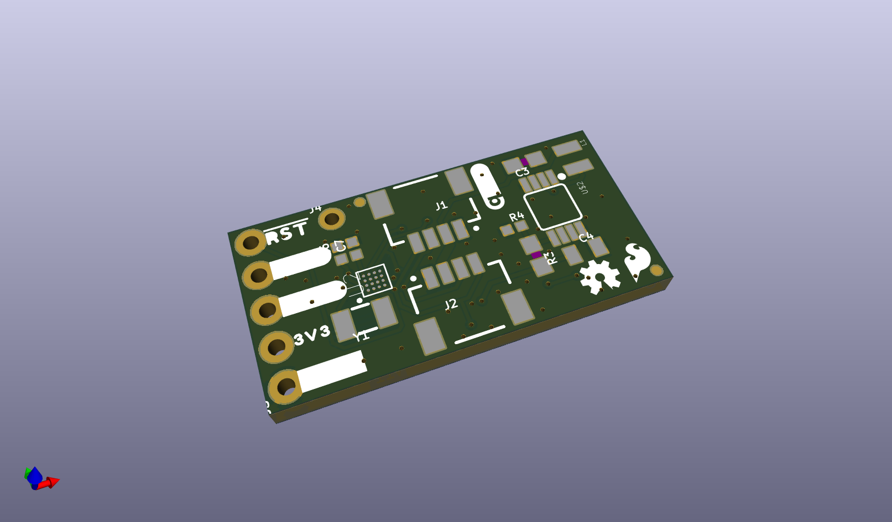
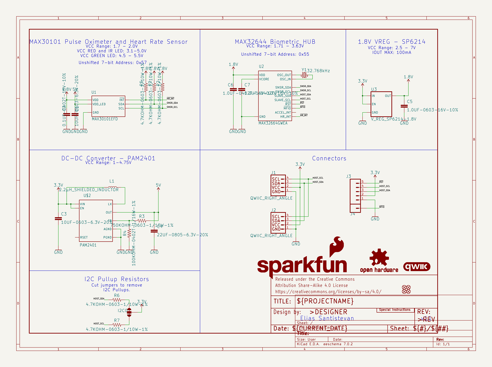
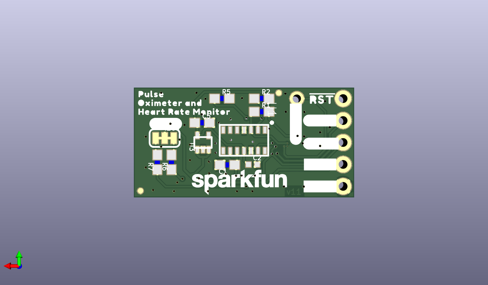
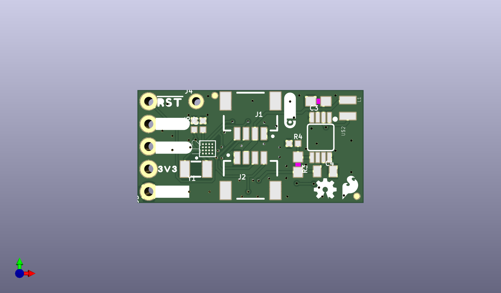

# None

## Description
None/
## Schematic

## Bill of Materials
| Id | Designator | Footprint | Quantity | Designation | Supplier and ref |  |
| --- | --- | --- | --- | --- | --- | --- |
| 1 | LOGO1 | SFE_LOGO_FLAME_.1 | 1 | SFE_LOGO_FLAME.1_INC H |  |  |
| 2 | C3,C1 | 0603 | 2 | 10uF |  |  |
| 3 | U$7 | 3V338 | 1 |  |  |  |
| 4 | FRAME1 | CREATIVE_COMMONS | 1 | FRAME-LETTER |  |  |
| 5 | J2,J1 | JST04_1MM_RA | 2 | QWIIC_RIGHT_ANGLE |  |  |
| 6 | J3 | 1X05_NO_SILK | 1 |  |  |  |
| 7 | C7,C6 | 0402-TIGHT | 2 | 1.0uF |  |  |
| 8 | FD4,FD2,FD1,FD3 | FIDUCIAL-MICRO | 4 | FIDUCIALUFIDUCIAL |  |  |
| 9 | LOGO4 | ORDERING_INSTRUCTION S | 1 | SPECIAL_INSTRUCTIONS -ORDERING |  |  |
| 10 | LOGO2 | OSHW-LOGO-MINI | 1 | OSHW-LOGOMINI |  |  |
| 11 | C4 | 0805 | 1 | 22uF |  |  |
| 12 | R4 | 0402-TIGHT | 1 | 100k |  |  |
| 13 | U$2 | MSOP8 | 1 | PAM2401 |  |  |
| 14 | U2 | 16_PIN_WLP | 1 | MAX32664GWEA |  |  |
| 15 | U$8 | #SDA#10 | 1 |  |  |  |
| 16 | LOGO5 | QWIIC_4MM | 1 | QWIIC_LOGO_4MM |  |  |
| 17 | Y1 | CRYSTAL-SMD-3.2X1.5M M | 1 | 32.768kHz |  |  |
| 18 | U$6,U$12 | #RST#32 | 2 |  |  |  |
| 19 | U$3,U$5 | #GND#0 | 2 |  |  |  |
| 20 | L1 | 0806 | 1 | 2.2μH |  |  |
| 21 | J4 | 1X01_NO_SILK | 1 |  |  |  |
| 22 | R3 | 0603 | 1 | 750K |  |  |
| 23 | U$4 | #SCL#7 | 1 |  |  |  |
| 24 | U3 | SC70 | 1 | 1.8V/100mA |  |  |
| 25 | U1 | 14_PIN_OESIP | 1 | MAX30101EFD |  |  |
| 26 | C2 | 0402-TIGHT | 1 | 0.1uF |  |  |
| 27 | U$9 | #3V3#1 | 1 |  |  |  |
| 28 | R1,R5,R6,R7,R2 | 0603 | 5 | 4.7k |  |  |
| 29 | U$21 | HEART_RATE_MONITOR37 | 1 |  |  |  |
| 30 | U$20 | OXIMETER_AND36 | 1 |  |  |  |
| 31 | I2C0 | SMT-JUMPER_3_2-NC_TR ACE_SILK | 1 | JUMPER-SMT_3_2-NC_TR ACE_SILK |  |  |
| 32 | C5 | 0603 | 1 | 1.0uF |  |  |
| 33 | U$13 | ##MFIO##12 | 1 |  |  |  |
| 34 | LOGO3 | SFE_LOGO_NAME_.1 | 1 | SFE_LOGO_NAME.1_INCH |  |  |
| 35 | U$10 | #SDA#9 | 1 |  |  |  |
| 36 | U$11 | #SCL#9 | 1 |  |  |  |
| 37 | U$1 | #I2C#1348 | 1 |  |  |  |
| 38 | U$17 | PULSE35 | 1 |  |  |  |

## Images

