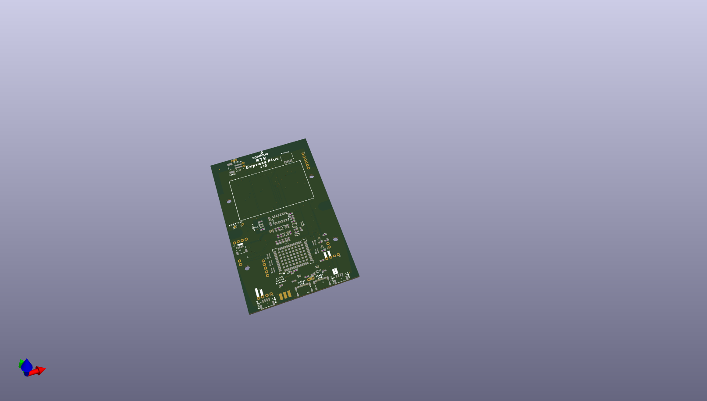
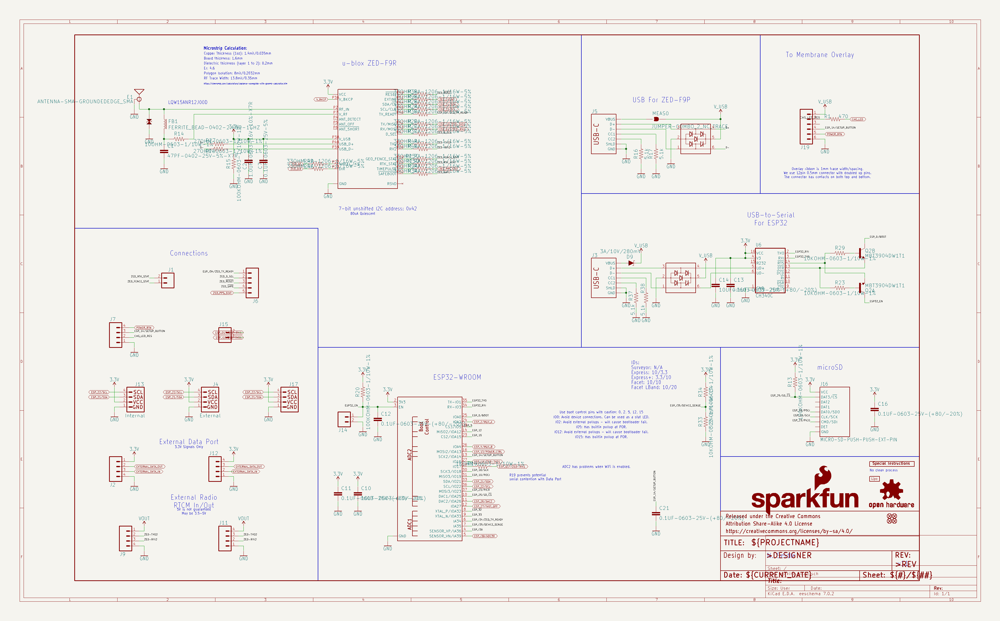
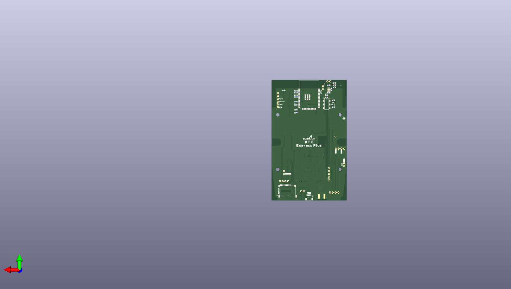
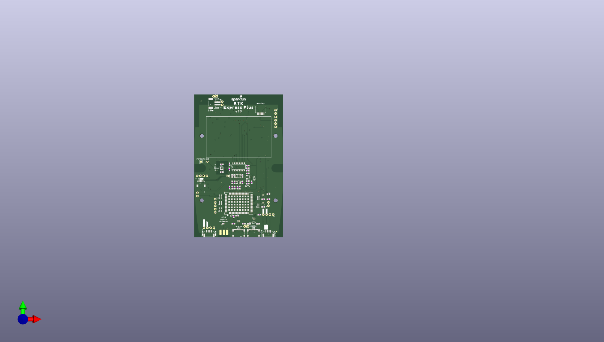

# None

## Description
None/
## Schematic

## Bill of Materials
| Id | Designator | Footprint | Quantity | Designation | Supplier and ref |  |
| --- | --- | --- | --- | --- | --- | --- |
| 1 | U$36,U$66 | USB1 | 2 |  |  |  |
| 2 | U$6 | L1#L20 | 1 |  |  |  |
| 3 | U$39 | #RX2#2 | 1 |  |  |  |
| 4 | R3,R9,R4,R2,R25 | 1206_RA | 5 | 33 |  |  |
| 5 | BT1 | LIPO-1000 | 1 | LIPO-OUTLINE1000 |  |  |
| 6 | U$24 | X0 | 1 |  |  |  |
| 7 | U$38,U$48,U$82 | #GND#0 | 3 |  |  |  |
| 8 | U$1 | V130 | 1 |  |  |  |
| 9 | D10 | 0402 | 1 | PESD0402-0402 |  |  |
| 10 | U2 | SOT23-5 | 1 | AP2112K-3.3 |  |  |
| 11 | U$2 | ORDERING_INSTRUCTION S | 1 | SPECIAL_INSTRUCTIONS -ORDERING |  |  |
| 12 | R37,R38,R17,R16 | 0603 | 4 | 5.1k |  |  |
| 13 | R14 | 0603 | 1 | 10 |  |  |
| 14 | J6 | 1X05_NO_SILK | 1 |  |  |  |
| 15 | U$56 | Z2 | 1 |  |  |  |
| 16 | E1 | SMA-EDGE | 1 | SMA |  |  |
| 17 | J17 | 1X04_NO_SILK | 1 | Qwiic Right Angle |  |  |
| 18 | U$23 | #3#5#5V#0 | 1 |  |  |  |
| 19 | J12,J11,J7 | 1X04_NO_SILK | 3 |  |  |  |
| 20 | U$67 | ESP320 | 1 |  |  |  |
| 21 | U9,U8 | SIP6 | 2 | NC7SZ14-D |  |  |
| 22 | C18,C6,C2,C4,C17 | 0603 | 5 | 1.0uF |  |  |
| 23 | U$43 | SERIAL20 | 1 |  |  |  |
| 24 | J2,J9 | JST-4-SMD-1.25MM-LOC KING | 2 |  |  |  |
| 25 | U$45,U$68 | #RX1#2 | 2 |  |  |  |
| 26 | U$13 | ACTIVE1 | 1 |  |  |  |
| 27 | R19,R7 | 0603 | 2 | 1k |  |  |
| 28 | R31,R6,R8,R29,R23,R1 8,R33 | 0603 | 7 | 10k |  |  |
| 29 | U$65,U$46 | #TX1#1 | 2 |  |  |  |
| 30 | Q1 | SOT26 | 1 | SIL2308-TP |  |  |
| 31 | J1,J14,J15,J10 | 1X02_NO_SILK | 4 |  |  |  |
| 32 | J3,J5 | USB-C-16P_4LAYER-PAD S | 2 | USB Female Type C Co nnector |  |  |
| 33 | JP21,JP61,JP81,JP71 | FIDUCIAL-MICRO | 4 | FIDUCIALUFIDUCIAL |  |  |
| 34 | J13 | JST04_1MM_RA | 1 | Internal |  |  |
| 35 | J8 | JST-2-SMD | 1 |  |  |  |
| 36 | U$40 | #TX2#1 | 1 |  |  |  |
| 37 | C1 | 0402 | 1 | 47pF |  |  |
| 38 | U$93,U$30 | QWIIC_4MM | 2 |  |  |  |
| 39 | C3,C5,C29,C28,C22,C1 5,C23,C7,C16,C27,C21 ,C13,C11,C12 | 0603 | 14 | 0.1uF |  |  |
| 40 | R26,R15,R22,R20,R13 | 0603 | 5 | 100k |  |  |
| 41 | D2,D6 | SOT886 | 2 | PRTR5V0U2F |  |  |
| 42 | U1 | SO16 | 1 | 74HC4052D |  |  |
| 43 | U$15 | ANTENNA2 | 1 |  |  |  |
| 44 | LOGO3,LOGO2 | SFE_LOGO_NAME_FLAME_ .1 | 2 | SFE_LOGO_NAME_FLAME. 1_INCH |  |  |
| 45 | U$27 | LIPO0 | 1 |  |  |  |
| 46 | MEAS0,MEAS1 | COMBO-JUMPER_2_NC_TR ACE | 2 | JUMPER-COMBO_2_NC_TR ACE |  |  |
| 47 | U13 | LGA-12-LISDH12 | 1 | LIS2DH12 |  |  |
| 48 | U7 | DFN-8 | 1 | MAX17048 |  |  |
| 49 | FB1 | 0402-TIGHT | 1 | 2.66Ω |  |  |
| 50 | U$50 | RADIO0 | 1 |  |  |  |
| 51 | U$29 | SERIAL10 | 1 |  |  |  |
| 52 | U$55 | Y1 | 1 |  |  |  |
| 53 | R27,R28 | 0603 | 2 | 27 |  |  |
| 54 | U4 | SOT23-5 | 1 | STLQ015-3.3V |  |  |
| 55 | R24 | 0603 | 1 | 300k |  |  |
| 56 | D9,D3,D7 | SOD-323 | 3 | 3A/10V/280mV |  |  |
| 57 | U$26 | 1553DBK-ENCLOSURE | 1 |  |  |  |
| 58 | J19 | FPC_6_1MM-LIF | 1 |  |  |  |
| 59 | U$22,U$12 | EXPRESS_PLUS0 | 2 |  |  |  |
| 60 | U$4 | INT0 | 1 |  |  |  |
| 61 | U$5,U$47 | #3V3#0 | 2 |  |  |  |
| 62 | J18 | 1X01_NO_SILK | 1 |  |  |  |
| 63 | U$35 | U#BLOX0 | 1 |  |  |  |
| 64 | C20,C19,C10,C14 | 0603 | 4 | 10uF |  |  |
| 65 | U11 | UBLOX_ZED_F9R | 1 | U-BLOX_ZED_F9R |  |  |
| 66 | U$9 | PWR_BTN1 | 1 |  |  |  |
| 67 | D1 | SOD-323 | 1 | 250mA/100V |  |  |
| 68 | U$8 | OVERLAY0 | 1 |  |  |  |
| 69 | FRAME3 | DUMMY | 1 | FRAME-LEDGERNO_FOOTP RINT |  |  |
| 70 | U$49 | NMEA1 | 1 |  |  |  |
| 71 | JP1 | SMT-JUMPER_2_NO_SILK | 1 | JUMPER-SMT_2_NO_SILK |  |  |
| 72 | FRAME2 | CREATIVE_COMMONS | 1 | FRAME-LEDGER |  |  |
| 73 | U$74,U$7 | RTK0 | 2 |  |  |  |
| 74 | U$85 | #3V3#2 | 1 |  |  |  |
| 75 | U$72 | #TX#1 | 1 |  |  |  |
| 76 | U$83 | MICROSD0 | 1 |  |  |  |
| 77 | U$42 | SETUP1 | 1 |  |  |  |
| 78 | U$17 | ##SAFE##5 | 1 |  |  |  |
| 79 | U$10 | #RTK#1 | 1 |  |  |  |
| 80 | J4 | JST04_1MM_RA | 1 | Qwiic Right Angle |  |  |
| 81 | U$11 | #PPS#0 | 1 |  |  |  |
| 82 | U$16 | ZED0 | 1 |  |  |  |
| 83 | U$33 | CHG2 | 1 |  |  |  |
| 84 | U6 | SO016 | 1 | CH340C |  |  |
| 85 | U$70 | #GND#2 | 1 |  |  |  |
| 86 | U$86 | #SCL#1 | 1 |  |  |  |
| 87 | U$34 | GND3 | 1 |  |  |  |
| 88 | C9,C8 | 0603 | 2 | 4.7uF |  |  |
| 89 | U$87 | #SDA#0 | 1 |  |  |  |
| 90 | J16 | MICROSD-EXTERNALPIN | 1 | MICRO-SD-PUSH-PUSH-E XT-PIN |  |  |
| 91 | U5 | ESP-WROOM-32D | 1 | ESP-WROOM-3232D |  |  |
| 92 | R34 | 0603 | 1 | 3.3k |  |  |
| 93 | R5 | 0603 | 1 | 0 |  |  |
| 94 | U$60 | #ESP_RST#0 | 1 |  |  |  |
| 95 | U10 | DFN-10 | 1 | MCP73833 |  |  |
| 96 | U$28 | ##RST##4 | 1 |  |  |  |
| 97 | U$41 | PWR0 | 1 |  |  |  |
| 98 | R1 | 0603 | 1 | 470 |  |  |
| 99 | U$84 | #GND#1 | 1 |  |  |  |
| 100 | U$88 | #D_SEL#0 | 1 |  |  |  |
| 101 | LOGO1 | OSHW-LOGO-MINI | 1 | OSHW-LOGOMINI |  |  |
| 102 | U$32 | #FENCE#3 | 1 |  |  |  |
| 103 | U$14 | #RX#2 | 1 |  |  |  |
| 104 | U$3 | #TX_RDY#0 | 1 |  |  |  |
| 105 | Q2 | SC70-6 | 1 | MBT3904DW1T1 |  |  |
| 106 | R30 | 0603 | 1 | 150k |  |  |

## Images

