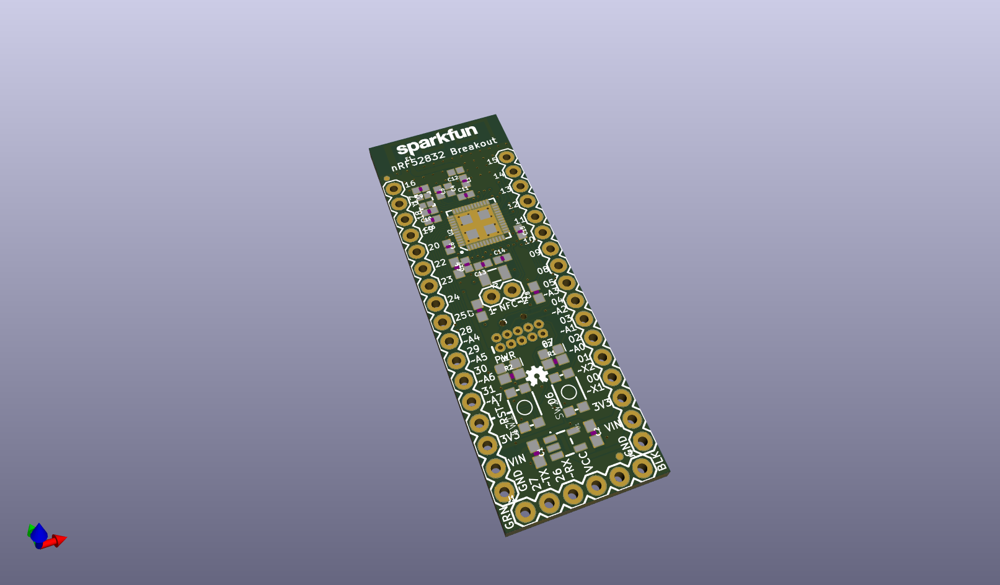
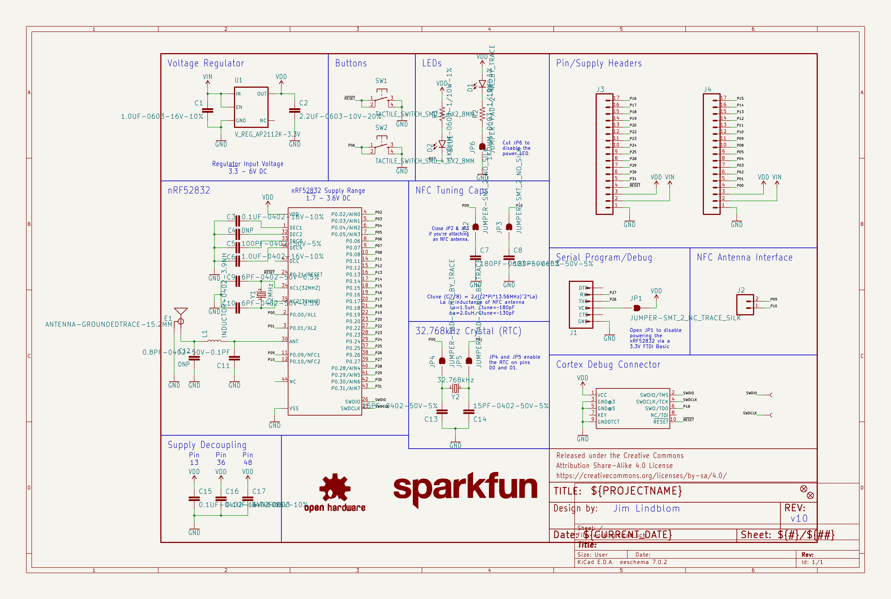
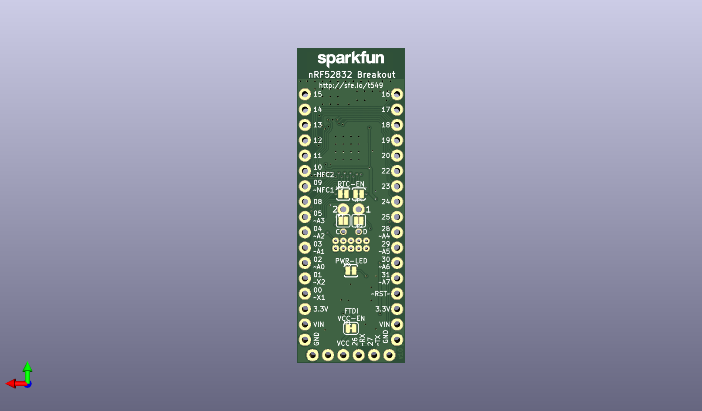
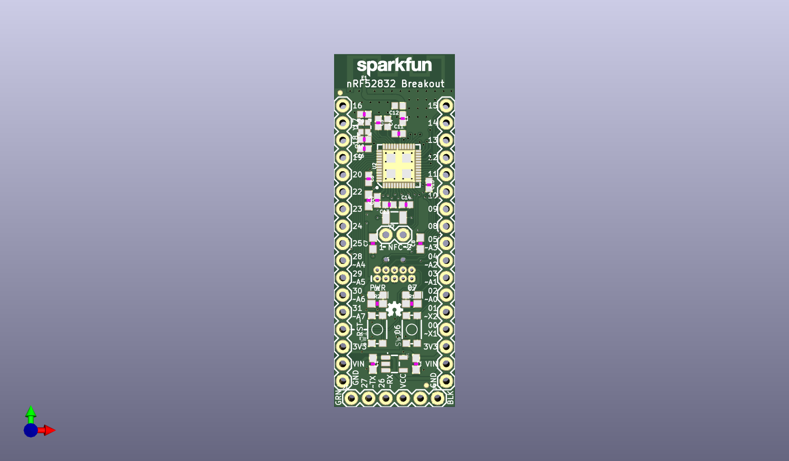

# None

## Description
None/
## Schematic

## Bill of Materials
| Id | Designator | Footprint | Quantity | Designation | Supplier and ref |  |
| --- | --- | --- | --- | --- | --- | --- |
| 1 | C3,C15,C16 | 0402 | 3 | 0.1uF |  |  |
| 2 | J4,J3 | 1X17 | 2 |  |  |  |
| 3 | R2,R1 | 0603 | 2 | 1k |  |  |
| 4 | Y1 | CRYSTAL-SMD-2.0X1.6M M | 1 | 32MHz |  |  |
| 5 | FD2,FD1 | FIDUCIAL-MICRO | 2 | FIDUCIALUFIDUCIAL |  |  |
| 6 | E1 | TRACE_ANTENNA_2.4GHZ _15.2MM | 1 | ANT |  |  |
| 7 | LOGO2,LOGO3 | SFE_LOGO_NAME_.1 | 2 | SFE_LOGO_NAME.1_INCH |  |  |
| 8 | C6 | 0402 | 1 | 1.0uF |  |  |
| 9 | C7,C8 | 0603 | 2 | 180pF |  |  |
| 10 | J1 | 1X06 | 1 |  |  |  |
| 11 | SW2,SW1 | TACTILE_SWITCH_SMD_4 .6X2.8MM | 2 | TACTILE_SWITCH_SMD_4 _6X2_8MM |  |  |
| 12 | D1 | LED-0603 | 1 | RED |  |  |
| 13 | C17 | 0603 | 1 | 4.7uF |  |  |
| 14 | U1 | SOT23-5 | 1 | AP2112K-3.3V |  |  |
| 15 | U2 | QFN48-6X6MM | 1 | NRF52832 |  |  |
| 16 | C13,C14 | 0402 | 2 | 15pF |  |  |
| 17 | FRAME1 | CREATIVE_COMMONS | 1 | FRAME-LETTER |  |  |
| 18 | C2 | 0603 | 1 | 2.2uF |  |  |
| 19 | C12,C4 | 0402 | 2 | DNP |  |  |
| 20 | C11 | 0402 | 1 | 0.8pF |  |  |
| 21 | LOGO1 | OSHW-LOGO-MINI | 1 | OSHW-LOGOMINI |  |  |
| 22 | C9,C10 | 0402 | 2 | 6pF |  |  |
| 23 | C5 | 0402 | 1 | 100pF |  |  |
| 24 | D2 | LED-0603 | 1 | BLUE |  |  |
| 25 | C1 | 0603 | 1 | 1.0uF |  |  |
| 26 | L1 | 0402 | 1 | 3.9nH |  |  |
| 27 | J5 | 2X5-PTH-1.27MM | 1 | CORTEX_DEBUGPTH |  |  |
| 28 | Y2 | CRYSTAL-SMD-3.2X1.5M M | 1 | 32.768kHz |  |  |
| 29 | J2 | 1X02 | 1 |  |  |  |
| 30 | TP2,TP1 | PAD.03X.04 | 2 | TEST-POINT3X4 |  |  |
| 31 | JP1 | SMT-JUMPER_2_NC_TRAC E_SILK | 1 | VDD-EN |  |  |
| 32 | JP5 | PAD-JUMPER-2-NC_BY_T RACE_YES_SILK | 1 | XL2 |  |  |
| 33 | JP6 | PAD-JUMPER-2-NC_BY_T RACE_YES_SILK | 1 | PWR-LED |  |  |
| 34 | JP2 | SMT-JUMPER_2_NO_SILK | 1 | NFC1 |  |  |
| 35 | JP3 | SMT-JUMPER_2_NO_SILK | 1 | NFC2 |  |  |
| 36 | JP4 | PAD-JUMPER-2-NC_BY_T RACE_YES_SILK | 1 | XL1 |  |  |

## Images

