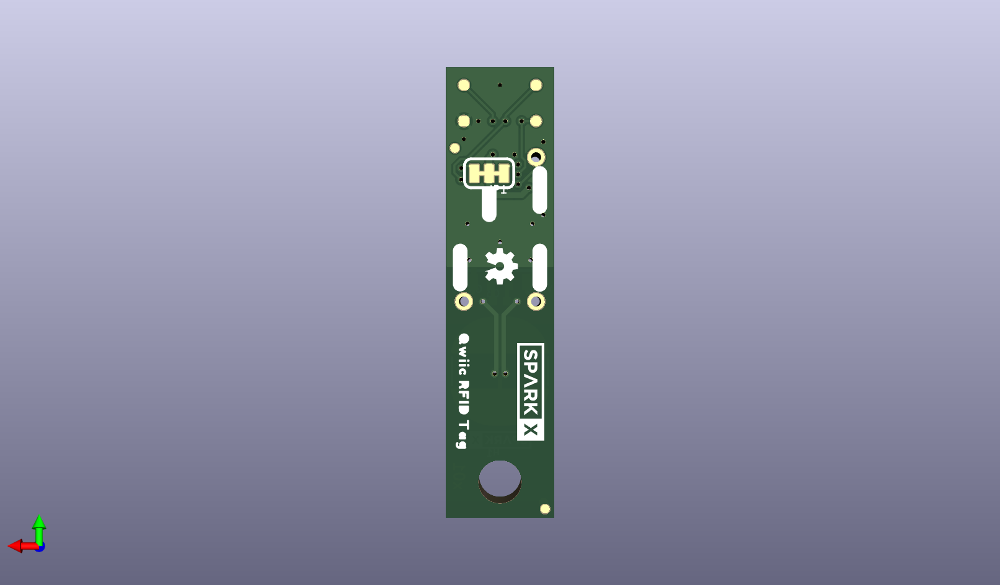

# None

## Description
None/
## Schematic

## Bill of Materials
| Id | Designator | Footprint | Quantity | Designation | Supplier and ref |  |
| --- | --- | --- | --- | --- | --- | --- |
| 1 | C3 | 0402-TIGHT | 1 | 0.5pF |  |  |
| 2 | VEH0,GND.0,!GPO!0 | 1X01_1MM_NO_SILK | 3 |  |  |  |
| 3 | U1 | SO08 | 1 | ST25DV64KC |  |  |
| 4 | FRAME2 | CREATIVE_COMMONS | 1 | FRAME-LETTER |  |  |
| 5 | R1,R2 | 0402-TIGHT | 2 | 2.2k |  |  |
| 6 | C1 | 0402-TIGHT | 1 | 0.1uF |  |  |
| 7 | U$1 | SPARKX-TINY | 1 | SPARKX-LOGO2 |  |  |
| 8 | C2 | 0402-TIGHT | 1 | 2.2uF |  |  |
| 9 | J1 | JST04_1MM_RA | 1 | QWIIC_RIGHT_ANGLE |  |  |
| 10 | ANT0 | W3102 | 1 | 4.7μH |  |  |
| 11 | H1 | STAND-OFF-TIGHT | 1 | STAND-OFFTIGHT |  |  |
| 12 | FD1,FD3,FD4,FD2 | FIDUCIAL-MICRO | 4 | FIDUCIALUFIDUCIAL |  |  |
| 13 | LOGO1 | ORDERING_INSTRUCTION S | 1 | SPECIAL_INSTRUCTIONS -ORDERING |  |  |
| 14 | SCL0,SDA0,UNK3V3,GND 0 | PAD.03X.03 | 4 | TEST-POINT3 |  |  |
| 15 | JP1 | SMT-JUMPER_3_2-NC_TR ACE_SILK | 1 | JUMPER-SMT_3_2-NC_TR ACE_SILK |  |  |
| 16 | U$6 | #GND#0 | 1 |  |  |  |
| 17 | LOGO2 | OSHW-LOGO-MINI | 1 | OSHW-LOGOMINI |  |  |
| 18 | U$2 | ##GPO##0 | 1 |  |  |  |
| 19 | U$5 | #I�C#0 | 1 |  |  |  |
| 20 | U$3 | QWIIC_RFID_TAG0 | 1 |  |  |  |
| 21 | U$4 | #VEH#0 | 1 |  |  |  |
| 22 | U$20 | SPARKX-SMALL | 1 | SPARKX-LOGO3 |  |  |

## Images

