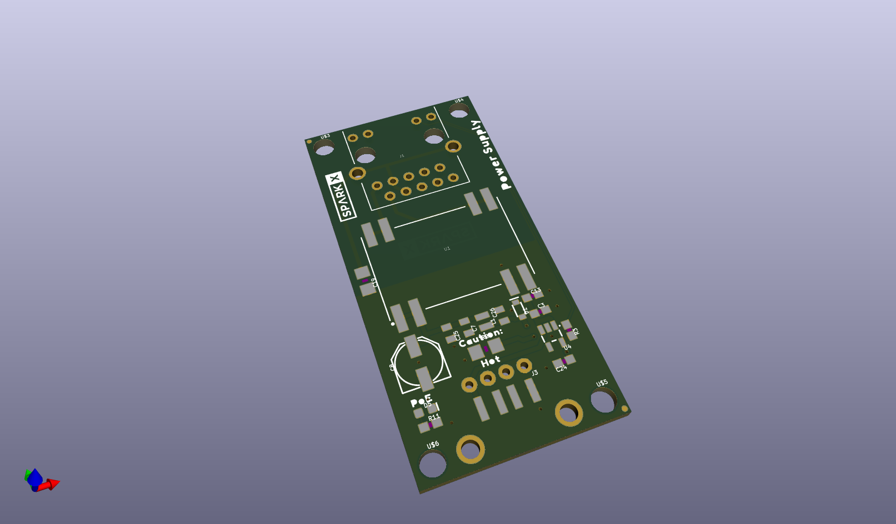
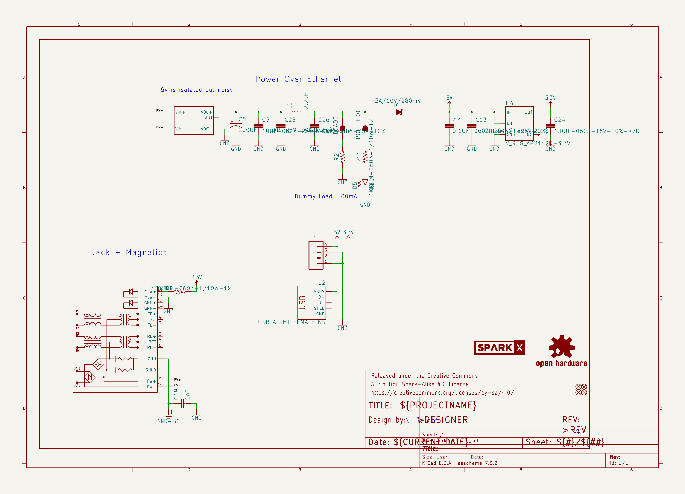
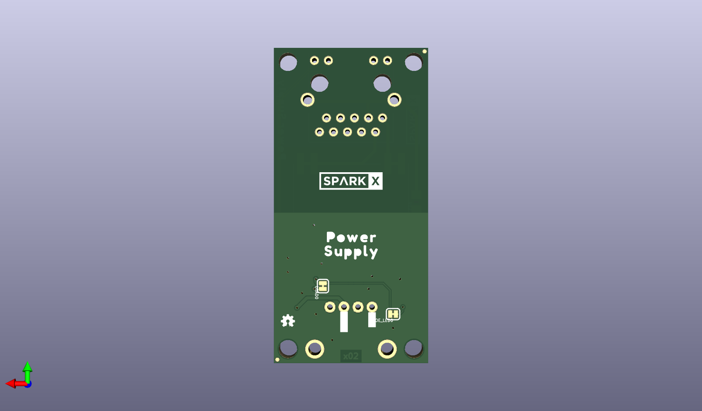
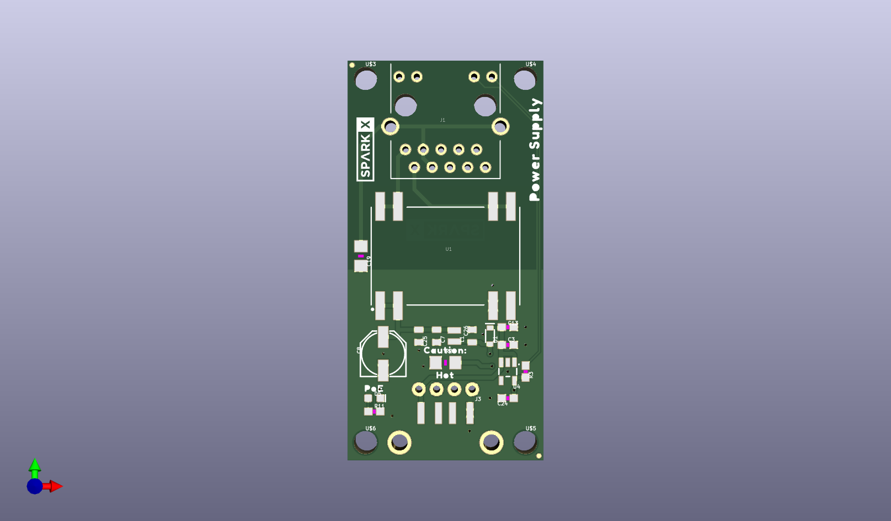

# None

## Description
None/
## Schematic

## Bill of Materials
| Id | Designator | Footprint | Quantity | Designation | Supplier and ref |  |
| --- | --- | --- | --- | --- | --- | --- |
| 1 | U$4,U$3,U$6,U$5 | STAND-OFF | 4 |  |  |  |
| 2 | C3 | 0603 | 1 | 0.1uF |  |  |
| 3 | U4 | SOT23-5 | 1 | 3.3V |  |  |
| 4 | U$15 | HOT1 | 1 |  |  |  |
| 5 | J2 | USB-A-S-NOSILK-FEMAL E | 1 | USB_A_SMT_FEMALE_NS |  |  |
| 6 | C13 | 0603 | 1 | 0.22uF |  |  |
| 7 | R3 | 0603 | 1 | 330 |  |  |
| 8 | D5 | LED-0603 | 1 | RED |  |  |
| 9 | C24 | 0603 | 1 | 1.0uF |  |  |
| 10 | J1 | MAGJACK-SYM_LED | 1 | MAGJACK-POE |  |  |
| 11 | C19 | 1206 | 1 | 1nF |  |  |
| 12 | D1 | SOD-323 | 1 | 3A/10V/280mV |  |  |
| 13 | FD1,FD2,FD3,FD4 | FIDUCIAL-MICRO | 4 | FIDUCIALUFIDUCIAL |  |  |
| 14 | C25,C7,C26 | 0805 | 3 | 10uF |  |  |
| 15 | U$21 | SUPPLY1 | 1 |  |  |  |
| 16 | R11 | 0603 | 1 | 1k |  |  |
| 17 | U$18,U$1 | #POE#0 | 2 |  |  |  |
| 18 | J3 | 1X04_NO_SILK | 1 |  |  |  |
| 19 | C8 | PANASONIC_D | 1 | 100uF |  |  |
| 20 | U$20 | POWER0 | 1 |  |  |  |
| 21 | FRAME1 | CREATIVE_COMMONS | 1 | FRAME-LETTER |  |  |
| 22 | L1 | 0805-WIDE | 1 | 2.2uH |  |  |
| 23 | R2 | 1206 | 1 | 49.9OHM-1206-1/2W-1% |  |  |
| 24 | U$16 | POE0 | 1 |  |  |  |
| 25 | U1 | DP990X | 1 | POE_PSU-DP990X |  |  |
| 26 | U$14 | CAUTION#0 | 1 |  |  |  |
| 27 | U$7 | SPARKX-MEDIUM | 1 | SPARKX-LOGO4 |  |  |
| 28 | U$12,U$13 | #GND#1 | 2 |  |  |  |
| 29 | U$19 | SPARKX-LARGE | 1 | SPARKX-LOGO4 |  |  |
| 30 | LOGO3 | OSHW-LOGO-MINI | 1 | OSHW-LOGOMINI |  |  |
| 31 | U$17 | POWER_0 | 1 |  |  |  |
| 32 | U$11 | #5V#2 | 1 |  |  |  |
| 33 | LOAD0,POE_LED0 | SMT-JUMPER_2_NC_TRAC E_SILK | 2 | JUMPER-SMT_2_NC_TRAC E_SILK |  |  |
| 34 | U$9 | #LOAD#0 | 1 |  |  |  |
| 35 | U$8 | #LED#0 | 1 |  |  |  |
| 36 | U$22 | SUPPLY_1 | 1 |  |  |  |
| 37 | U$10 | #3V3#0 | 1 |  |  |  |

## Images

