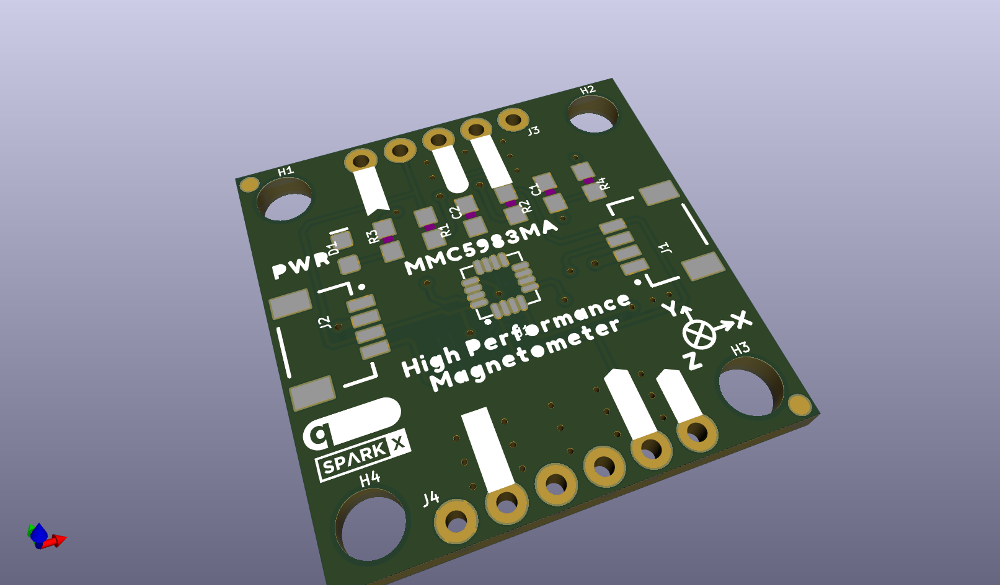
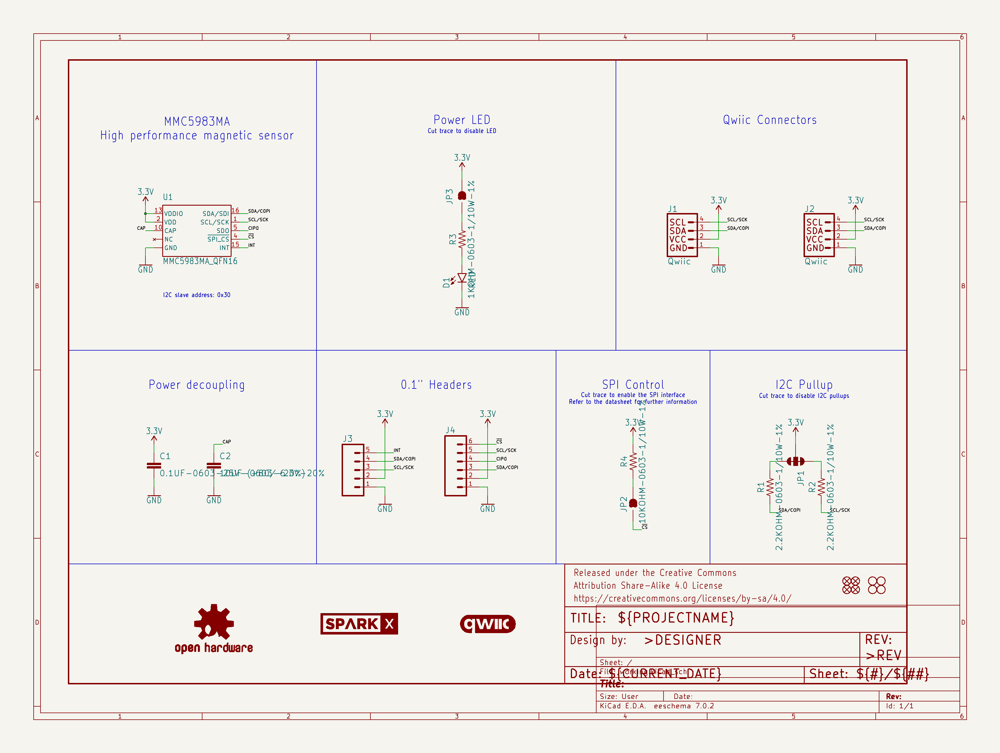
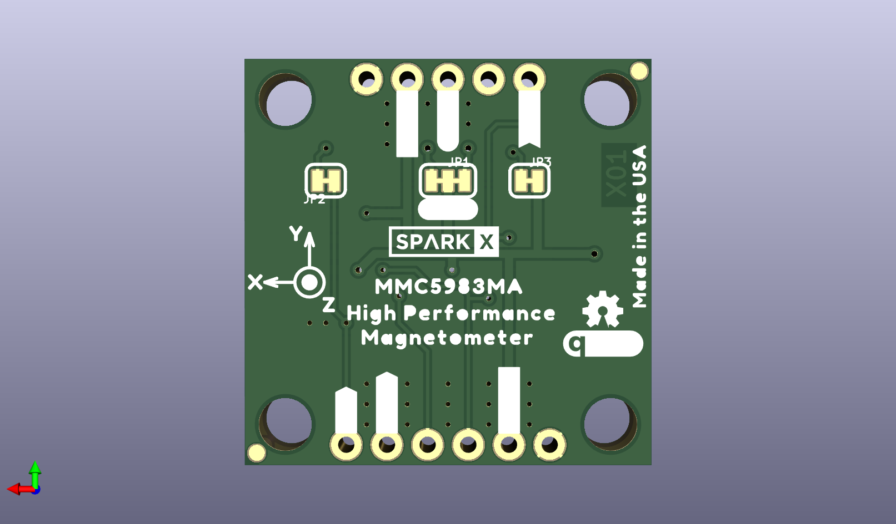
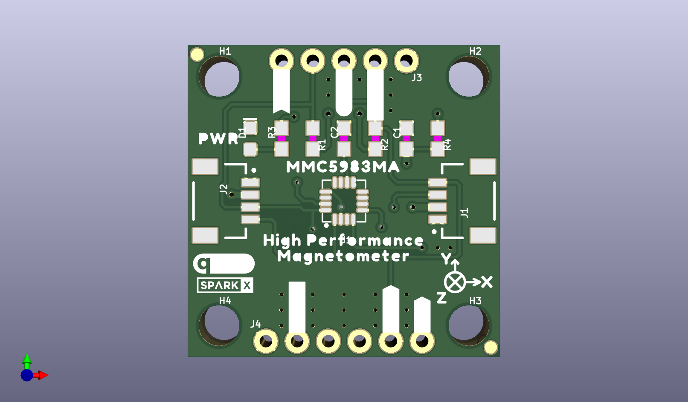

# None

## Description
None/
## Schematic

## Bill of Materials
| Id | Designator | Footprint | Quantity | Designation | Supplier and ref |  |
| --- | --- | --- | --- | --- | --- | --- |
| 1 | H3,H2,H4,H1 | STAND-OFF | 4 | STAND-OFF |  |  |
| 2 | J2,J1 | JST04_1MM_RA | 2 | Qwiic |  |  |
| 3 | U$5,U$38 | #SDA#5 | 2 |  |  |  |
| 4 | FRAME1 | DUMMY | 1 | FRAME-LETTERNO_PACKA GE |  |  |
| 5 | U$8 | PWR9 | 1 |  |  |  |
| 6 | U$4,U$17,U$13,U$28 | #GND#4 | 4 |  |  |  |
| 7 | U$3,U$18,U$29,U$12 | #3#3V#0 | 4 |  |  |  |
| 8 | U$10,U$1 | HIGH_PERFORMANCE11 | 2 |  |  |  |
| 9 | R2,R1 | 0603 | 2 | 2.2k |  |  |
| 10 | U$2,U$35 | #SCL#6 | 2 |  |  |  |
| 11 | C2 | 0603 | 1 | 10uF |  |  |
| 12 | FD2,FD1,FD3,FD4 | FIDUCIAL-1X2 | 4 | FIDUCIAL1X2 |  |  |
| 13 | U$41,U$42 | MMC5983MA0 | 2 |  |  |  |
| 14 | U$20,U$25 | X15 | 2 |  |  |  |
| 15 | U1 | LGA-16-3X3MM-4X4PINS | 1 | MMC5983MA_QFN16 |  |  |
| 16 | J4 | 1X06_NO_SILK | 1 |  |  |  |
| 17 | D1 | LED-0603 | 1 | RED |  |  |
| 18 | U$19,U$26 | Y16 | 2 |  |  |  |
| 19 | U$11,U$24 | MAGNETOMETER12 | 2 |  |  |  |
| 20 | U$15,U$33 | ##CS##10 | 2 |  |  |  |
| 21 | U$9,U$30 | #COPI#12 | 2 |  |  |  |
| 22 | LOGO3,LOGO2 | QWIIC_5MM | 2 | QWIIC_LOGO_5MM |  |  |
| 23 | U$14,U$32 | #SCK#13 | 2 |  |  |  |
| 24 | U$36 | SPARKX-TINY | 1 | SPARKX-LOGO2 |  |  |
| 25 | R4 | 0603 | 1 | 10k |  |  |
| 26 | R3 | 0603 | 1 | 1k |  |  |
| 27 | C1 | 0603 | 1 | 0.1uF |  |  |
| 28 | U$39,U$27 | Z17 | 2 |  |  |  |
| 29 | U$7,U$16 | #INT#7 | 2 |  |  |  |
| 30 | J3 | 1X05_NO_SILK | 1 |  |  |  |
| 31 | U$6,U$31 | #CIPO#11 | 2 |  |  |  |
| 32 | U$23 | #SPI#9 | 1 |  |  |  |
| 33 | LOGO1 | OSHW-LOGO-MINI | 1 | OSHW-LOGOMINI |  |  |
| 34 | JP3,JP2 | SMT-JUMPER_2_NC_TRAC E_SILK | 2 | JUMPER-SMT_2_NC_TRAC E_SILK |  |  |
| 35 | U$34 | MADE_IN_THE_USA20 | 1 |  |  |  |
| 36 | U$37 | SPARKX-SMALL | 1 | SPARKX-LOGO3 |  |  |
| 37 | U$21 | #LED#8 | 1 |  |  |  |
| 38 | U$22 | #I2C#9 | 1 |  |  |  |
| 39 | JP1 | SMT-JUMPER_3_2-NC_TR ACE_SILK | 1 | JUMPER-SMT_3_2-NC_TR ACE_SILK |  |  |

## Images

