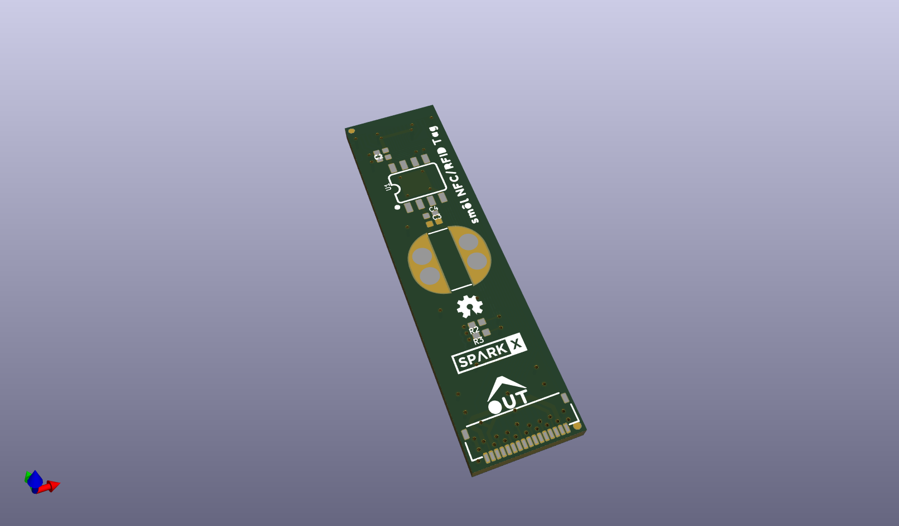
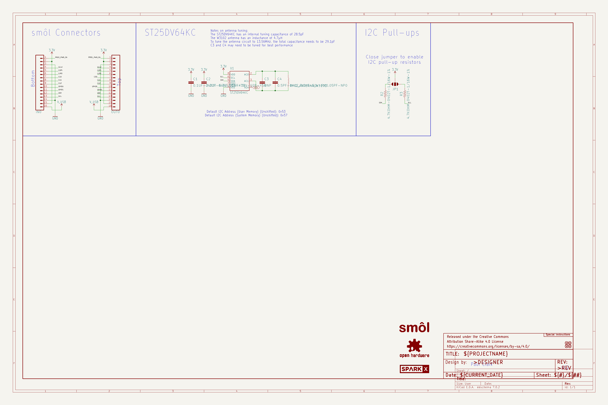
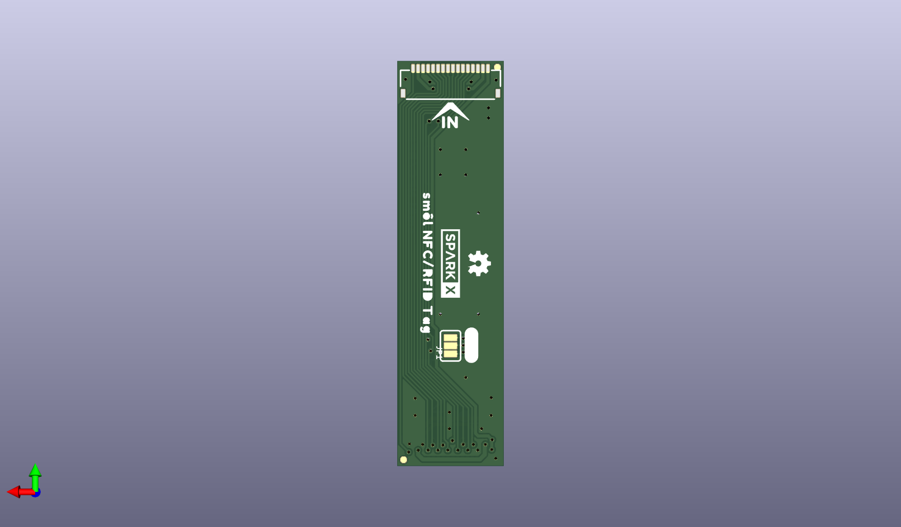
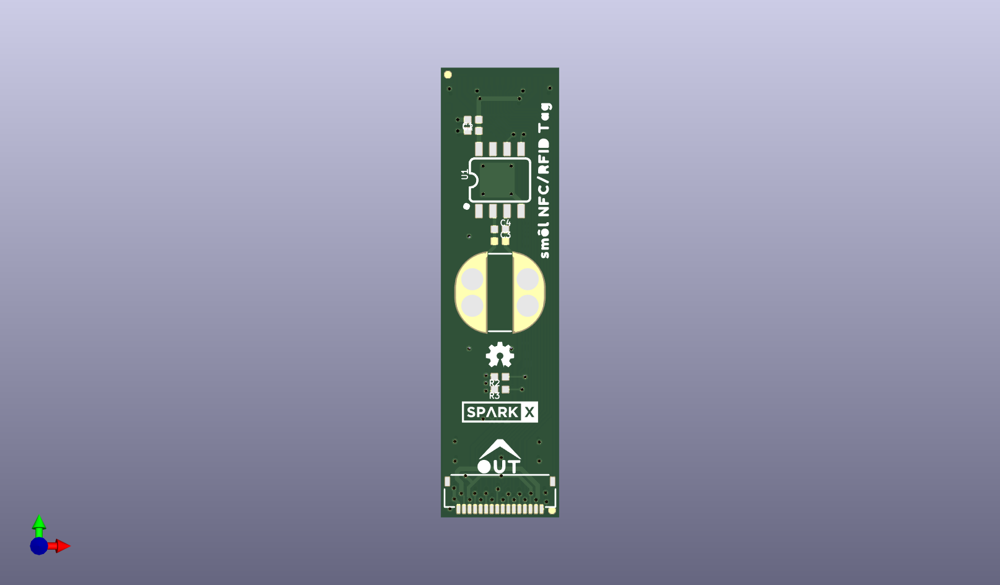

# None

## Description
None/
## Schematic

## Bill of Materials
| Id | Designator | Footprint | Quantity | Designation | Supplier and ref |  |
| --- | --- | --- | --- | --- | --- | --- |
| 1 | FD3,FD1,FD2,FD4 | FIDUCIAL-MICRO | 4 | FIDUCIALUFIDUCIAL |  |  |
| 2 | R2,R3 | 0402-TIGHT | 2 | 4.7k |  |  |
| 3 | C3 | 0402-TIGHT_NO_CREAM | 1 | DNP |  |  |
| 4 | U$3,U$9 | SMOL_SMALL | 2 | SMOL_LOGOSMALL |  |  |
| 5 | FRAME1 | CREATIVE_COMMONS | 1 | FRAME-LEDGER |  |  |
| 6 | OUT0,IN0 | FPC_16_0.5MM | 2 |  |  |  |
| 7 | U$17 | OUT0 | 1 |  |  |  |
| 8 | LOGO1 | ORDERING_INSTRUCTION S | 1 | SPECIAL_INSTRUCTIONS -ORDERING |  |  |
| 9 | C2 | 0402-TIGHT | 1 | 2.2uF |  |  |
| 10 | LOGO2,LOGO3 | OSHW-LOGO-MINI | 2 | OSHW-LOGOMINI |  |  |
| 11 | C4 | 0402-TIGHT | 1 | 0.5pF |  |  |
| 12 | U$1,U$20 | SPARKX-SMALL | 2 | SPARKX-LOGO3 |  |  |
| 13 | U1 | SO08 | 1 | ST25DV64KC |  |  |
| 14 | C1 | 0402-TIGHT | 1 | 0.1uF |  |  |
| 15 | U$2,U$4 | SM�L_NFC#RFID_TAG0 | 2 |  |  |  |
| 16 | ANT0 | W3102 | 1 | 4.7μH |  |  |
| 17 | U$8 | IN0 | 1 |  |  |  |
| 18 | U$5 | #I�C#0 | 1 |  |  |  |
| 19 | JP1 | SMT-JUMPER_3_NO_SILK | 1 | JUMPER-SMT_3_NO_SILK |  |  |

## Images

